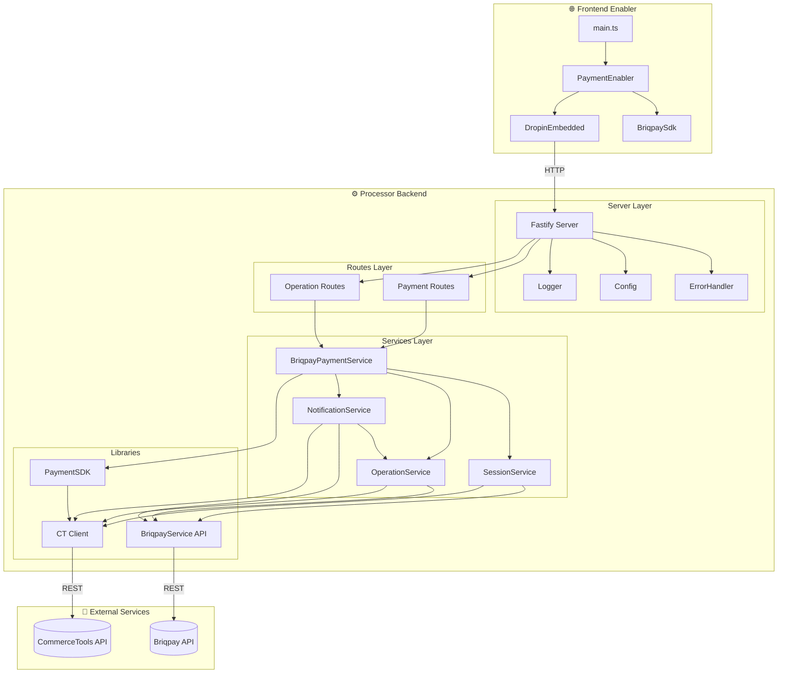
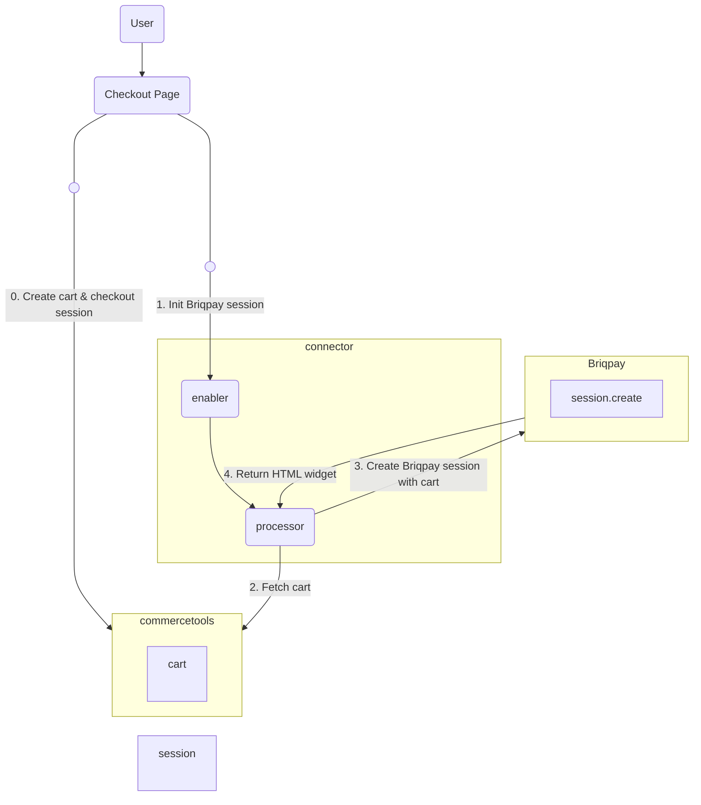
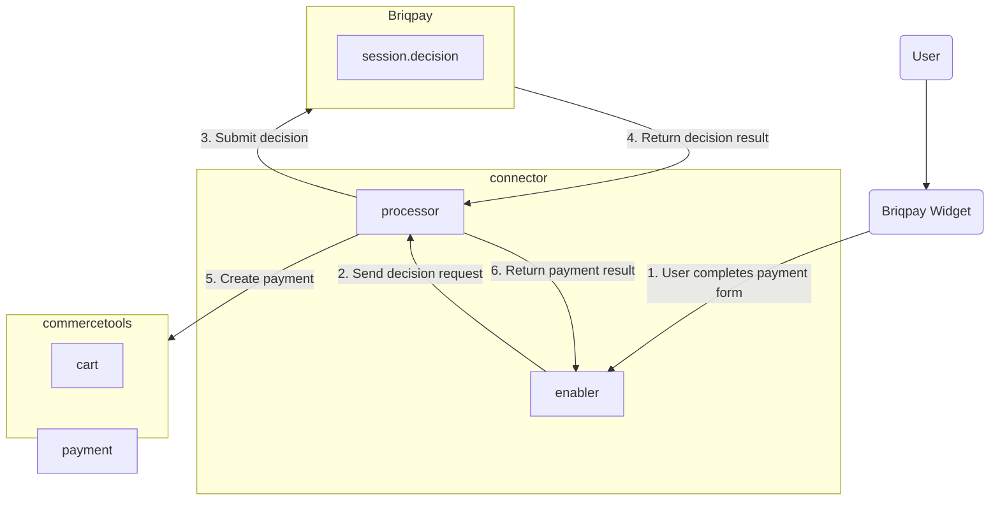
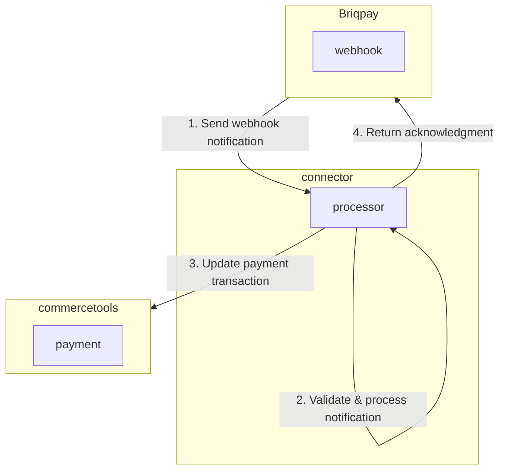

# Briqpay Payment Integration for commercetools Connect

A comprehensive commercetools Connect payment integration connector for Briqpay, providing seamless payment processing capabilities with modern TypeScript architecture, Docker containerization, and enterprise-grade deployment configurations.

- [Features](#features)
- [How to Install](#how-to-install)
- [Overview](#overview)
- [Prerequisites](#prerequisites)
- [Architecture](#architecture-overview)
- [Development Guide](#development-guide)
- [Testing](#testing)
- [Best Practices](#best-practices)

## Features

- **TypeScript** language support with strict type checking
- **Fastify** high-performance web framework for the processor backend
- **Vite** modern build tool for the enabler frontend
- Uses [commercetools Connect Payments SDK](https://docs.commercetools.com/connect) for commercetools-specific communication
- Displays Briqpay payment widget in a single embedded iframe
- Supports multiple payment methods through Briqpay (invoice, installments, etc.)
- Real-time payment session synchronization between Briqpay and commercetools
- Webhook support for asynchronous payment status updates (capture, refund, cancel)
- Dynamic custom type extension for storing Briqpay session data on orders (extends existing order types or creates new ones)
- Supports payment operations: authorize, capture, refund, cancel, and reverse
- Includes local development utilities with Docker Compose setup
- Jest testing framework with MSW for API mocking

## How to Install

1. **Create Connect application** and install Briqpay connector in commercetools Connect

2. **Create commercetools API client** with the following scopes (your case may vary):

   > Please refer to the [commercetools documentation regarding scopes](https://docs.commercetools.com/api/scopes), names may change and names might be different from what you see in the GUI.
   - **Manage**:
     - `manage_orders` - Also grants permission to manage Carts
     - `manage_sessions` (Manage Checkout sessions)
     - `manage_types`
     - `manage_payments`
     - `manage_checkout_transactions`
     - `manage_checkout_payment_intents`
     - `manage_key_value_documents`
   - **View**:
     - `view_key_value_documents` (View Custom Objects)
     - `view_states`
     - `view_types`
     - `view_product_selections`
     - `view_attribute_groups`
     - `view_shopping_lists`
     - `view_shipping_methods`
     - `view_categories`
     - `view_discount_codes`
     - `view_products`
     - `view_cart_discounts`
     - `view_orders`
     - `view_stores`
     - `view_tax_categories`
     - `view_order_edits`


After creating your API client, the scopes/permissions should look like this:

```text
client_credentials&scope=manage_orders:{projectKey} view_states:{projectKey} view_types:{projectKey} view_product_selections:{projectKey} view_attribute_groups:{projectKey} view_shopping_lists:{projectKey} manage_sessions:{projectKey} manage_types:{projectKey} manage_checkout_payment_intents:{projectKey} view_categories:{projectKey} manage_key_value_documents:{projectKey} view_discount_codes:{projectKey} view_products:{projectKey} view_cart_discounts:{projectKey} manage_payments:{projectKey} view_orders:{projectKey} view_shipping_methods:{projectKey} view_stores:{projectKey} manage_checkout_transactions:{projectKey} view_tax_categories:{projectKey} view_order_edits:{projectKey}
```

3. **Set commercetools configuration values**:
   - `CTP_PROJECT_KEY`
   - `CTP_CLIENT_ID`
   - `CTP_CLIENT_SECRET`
   - `CTP_AUTH_URL`
   - `CTP_API_URL`
   - `CTP_SESSION_URL`
   - `CTP_JWKS_URL`
   - `CTP_JWT_ISSUER`

4. **Create Briqpay API credentials** and set configuration values:
   - `BRIQPAY_USERNAME`
   - `BRIQPAY_SECRET`
   - `BRIQPAY_WEBHOOK_SECRET` - **Mandatory** for secure webhook processing (HMAC verification) (get your webhook secret at https://app.briqpay.com/dashboard/developers/webhooks)
   - `BRIQPAY_BASE_URL`
   - `BRIQPAY_TERMS_URL`
   - `BRIQPAY_CONFIRMATION_URL`

5. **Optionally set custom type keys**:

   > **IMPORTANT**: Please use the default names to preserve data integrity.
   - `BRIQPAY_SESSION_CUSTOM_TYPE_KEY` - Default: `briqpay-session-id`
   - `BRIQPAY_PSP_META_DATA_CUSTOMER_FACING_REFERENCE_KEY` - Default: `briqpay-psp-meta-data-customer-facing-reference`
   - `BRIQPAY_PSP_META_DATA_DESCRIPTION_KEY` - Default: `briqpay-psp-meta-data-description`
   - `BRIQPAY_PSP_META_DATA_TYPE_KEY` - Default: `briqpay-psp-meta-data-type`
   - `BRIQPAY_PSP_META_DATA_PAYER_EMAIL_KEY` - Default: `briqpay-psp-meta-data-payer-email`
   - `BRIQPAY_PSP_META_DATA_PAYER_FIRST_NAME_KEY` - Default: `briqpay-psp-meta-data-payer-first-name`
   - `BRIQPAY_PSP_META_DATA_PAYER_LAST_NAME_KEY` - Default: `briqpay-psp-meta-data-payer-last-name`
   - `BRIQPAY_TRANSACTION_DATA_RESERVATION_ID_KEY` - Default: `briqpay-transaction-data-reservation-id`
   - `BRIQPAY_TRANSACTION_DATA_SECONDARY_RESERVATION_ID_KEY` - Default: `briqpay-transaction-data-secondary-reservation-id`
   - `BRIQPAY_TRANSACTION_DATA_PSP_ID_KEY` - Default: `briqpay-transaction-data-psp-id`
   - `BRIQPAY_TRANSACTION_DATA_PSP_DISPLAY_NAME_KEY` - Default: `briqpay-transaction-data-psp-display-name`
   - `BRIQPAY_TRANSACTION_DATA_PSP_INTEGRATION_NAME_KEY` - Default: `briqpay-transaction-data-psp-integration-name`

   > **Note**: The connector dynamically extends existing custom types for the `order` resource type instead of always creating separate types. If field name conflicts exist, Briqpay fields are prefixed with `briqpay-` to avoid data loss.

6. **Deploy on Connect**

7. Once deployment is successful, store URLs for Enabler and Processor applications as `VITE_PROCESSOR_URL` in your frontend configuration

8. Follow [Usage Guide](#enabler-usage) to integrate the connector in your frontend

## Overview

The Briqpay integration connector contains two modules:

- **Enabler**: Acts as a wrapper implementation in which frontend components from Briqpay are embedded. It gives control to the checkout product on when and how to load the connector frontend based on business configuration. The connector library can be loaded directly on the frontend instead of communicating with Briqpay platform from the frontend.

- **Processor**: Acts as backend services which is middleware to integrate with Briqpay platform. It is mainly responsible for managing payment sessions initialized in Briqpay platform and updating payment entities in commercetools. The request context, commercetools checkout sessions, and other tools necessary to transact are all maintained inside this module.

## Prerequisites

#### 1. commercetools API Client

Create an API client responsible for payment management in your commercetools project. Details of the API client are taken as input as environment variables/configuration for connect such as `CTP_PROJECT_KEY`, `CTP_CLIENT_ID`, `CTP_CLIENT_SECRET`. The API client should have the following scopes:

- **Manage**:
  - `manage_orders`
  - `manage_sessions` (Manage Checkout sessions)
  - `manage_types`
  - `manage_payments`
  - `manage_checkout_transactions`
  - `manage_checkout_payment_intents`
  - `manage_key_value_documents`
- **View**:
  - `view_key_value_documents` (View Custom Objects)
  - `view_states`
  - `view_types`
  - `view_product_selections`
  - `view_attribute_groups`
  - `view_shopping_lists`
  - `view_shipping_methods`
  - `view_categories`
  - `view_discount_codes`
  - `view_products`
  - `view_cart_discounts`
  - `view_orders`
  - `view_stores`
  - `view_tax_categories`
  - `view_order_edits`


#### 2. commercetools Platform URLs

Various URLs from commercetools platform are required:

- `CTP_API_URL` - commercetools API URL
- `CTP_AUTH_URL` - commercetools Auth URL
- `CTP_SESSION_URL` - Session API URL
- `CTP_JWKS_URL` - JWKs URL for JWT validation
- `CTP_JWT_ISSUER` - JWT Issuer URL

#### 3. Briqpay API Credentials

Obtain API credentials from Briqpay:

- `BRIQPAY_USERNAME` - Your Briqpay API username
- `BRIQPAY_SECRET` - Your Briqpay API secret
- `BRIQPAY_BASE_URL` - Briqpay API URL (staging or production)

#### 4. Merchant URLs

Configure your merchant URLs:

- `BRIQPAY_TERMS_URL` - URL to your terms and conditions page
- `BRIQPAY_CONFIRMATION_URL` - URL to your order confirmation page

## 🏗️ Architecture Overview

This payment integration follows commercetools Connect's dual-component architecture:



### 🎯 Enabler (Frontend Component)

- **Purpose**: Frontend wrapper that embeds Briqpay payment components
- **Technology**: TypeScript, Vite, SCSS
- **Port**: 3000
- **Functionality**: Provides payment UI components and manages frontend payment flow

### ⚙️ Processor (Backend Component)

- **Purpose**: Backend middleware for transaction management and commercetools integration
- **Technology**: TypeScript, Fastify, commercetools SDK
- **Port**: 8080
- **Functionality**: Handles payment operations, session management, and commercetools API interactions

### Initial Flow



0. Merchant creates the cart and [checkout session](https://docs.commercetools.com/checkout/installing-checkout#create-checkout-sessions) in commercetools before initializing the Briqpay session.
1. Checkout page retrieves SDK from `enabler`. After loading, it sends request via SDK to `processor` to trigger Briqpay session initialization.
2. The `processor` fetches the latest cart from commercetools using the provided checkout session.
3. Briqpay receives cart details from the `processor` and initializes a payment session.
4. Briqpay returns HTML snippet of the widget containing payment method options. The snippet is returned to the frontend for display.

### Payment Decision Flow



1. User completes the payment form in the Briqpay widget and triggers `session_complete` event.
2. The `enabler` captures the event and sends a decision request to the `processor`.
3. The `processor` submits the decision to Briqpay API.
4. Briqpay returns the decision result (approved/denied).
5. The `processor` creates a payment in commercetools with the authorization transaction.
6. The result is returned to the frontend for order completion.

### Webhook Notification Flow



1. Briqpay sends webhook notifications for events like `ORDER_STATUS`, `CAPTURE_STATUS`, `REFUND_STATUS`.
2. The `processor` validates and processes the notification.
3. Payment transactions in commercetools are updated based on the notification status.
4. Acknowledgment is returned to Briqpay.

## Important Notes

- The connector stores the Briqpay session ID as a custom field on the commercetools **cart** during checkout, which is then transferred to the order. The custom type is specified by `BRIQPAY_SESSION_CUSTOM_TYPE_KEY`.

- Webhook notifications from Briqpay are processed asynchronously. Ensure your webhook endpoint is publicly accessible and properly configured in the Briqpay dashboard.

- The connector supports the following payment operations through the `/operations/payment-intents/:id` endpoint:
  - `capturePayment` - Capture an authorized payment
  - `cancelPayment` - Cancel an authorized payment
  - `refundPayment` - Refund a captured payment
  - `reversePayment` - Reverse a payment

- For local development, use the provided Docker Compose setup which includes a mock JWT server for authentication.

## 🚀 Quick Start

### Prerequisites

1. **Node.js 20+** - Required for both components
2. **Docker & Docker Compose** - For local development environment
3. **commercetools Project** - With API client configured
4. **Briqpay Account** - With API credentials

### Environment Setup

1. **Clone and navigate to the project**:

   ```bash
   cd commercetools
   ```

2. **Configure environment variables**:

   ```bash
   # Enabler environment
   cp enabler/.env.template enabler/.env

   # Processor environment
   cp processor/.env.template processor/.env
   ```

3. **Update environment files** with your actual credentials:
   - commercetools API credentials (project key, client ID, secret)
   - Briqpay API credentials (username, secret)
   - URLs for your environment (terms, confirmation pages)

### Local Development

#### Option 1: Docker Compose (Recommended)

```bash
# Build enabler first (required for Docker setup)
cd enabler && npm run build && cd ..

# Start all services with Docker Compose
docker-compose up
```

This starts three services:

- **JWT Server** (port 9002 → 9000 internal) - Mock JWT server for development
- **Enabler** (port 3000) - Frontend payment components
- **Processor** (port 8080) - Backend payment services

#### Option 2: Manual Development

```bash
# Terminal 1: Start Processor
cd processor
npm install

npm run watch

# Terminal 2: Start Enabler
cd enabler
npm install
npm run dev

# Terminal 3: Start JWT Server (if not using Docker)
npx --package jwt-mock-server -y start
```

## Development Guide

### Folder Structure

```
├── enabler
│   ├── src
│   │   ├── components/
│   │   ├── dropin/
│   │   ├── payment-enabler/
│   │   ├── briqpay-sdk.ts
│   │   └── main.ts
│   ├── test
│   └── package.json
├── processor
│   ├── src
│   │   ├── config/
│   │   ├── connectors/
│   │   ├── custom-types/
│   │   ├── dtos/
│   │   ├── libs/
│   │   ├── routes/
│   │   ├── server/
│   │   ├── services/
│   │   ├── main.ts
│   │   └── payment-sdk.ts
│   ├── test
│   └── package.json
├── connect.yaml
├── docker-compose.yaml
└── README.md
```

### Deployment Configuration

Connect deployment configuration is specified in `connect.yaml` which contains the required information for publishing the application:

```yaml
deployAs:
  - name: enabler
    applicationType: assets
  - name: processor
    applicationType: service
    endpoint: /
    scripts:
      postDeploy: npm install && npm run connector:post-deploy
      preUndeploy: npm install && npm run connector:pre-undeploy
    configuration:
      standardConfiguration:
        - key: CTP_PROJECT_KEY
          description: commercetools project key
          required: true
        - key: CTP_CLIENT_ID
          description: commercetools client ID
          required: true
        - key: CTP_AUTH_URL
          description: commercetools Auth URL
          required: true
          default: https://auth.europe-west1.gcp.commercetools.com
        - key: CTP_API_URL
          description: commercetools API URL
          required: true
          default: https://api.europe-west1.gcp.commercetools.com
        - key: CTP_SESSION_URL
          description: Session API URL
          required: true
          default: https://session.europe-west1.gcp.commercetools.com
        - key: CTP_JWKS_URL
          description: JWKs url (example - https://mc-api.europe-west1.gcp.commercetools.com/.well-known/jwks.json)
          required: true
          default: https://mc-api.europe-west1.gcp.commercetools.com/.well-known/jwks.json
        - key: CTP_JWT_ISSUER
          description: JWT Issuer for jwt validation (example - https://mc-api.europe-west1.gcp.commercetools.com)
          required: true
          default: https://mc-api.europe-west1.gcp.commercetools.com
        - key: BRIQPAY_USERNAME
          description: Your Briqpay API username
          required: true
        - key: BRIQPAY_BASE_URL
          description: The Briqpay API url
          required: true
          default: https://playground-api.briqpay.com/v3
        - key: BRIQPAY_TERMS_URL
          description: The URL to your terms page
          required: true
        - key: BRIQPAY_CONFIRMATION_URL
          description: The URL to your order confirmation page
          required: true
        # IMPORTANT: Please use the default names to preserve data integrity.
        # Changing these keys/field names after you already have data can orphan existing custom fields
        # and break session/payment data lookups.
        - key: BRIQPAY_SESSION_CUSTOM_TYPE_KEY
          description: Key of CustomType to store briqpay session inside cart
          required: false
          default: briqpay-session-id
        - key: BRIQPAY_PSP_META_DATA_CUSTOMER_FACING_REFERENCE_KEY
          description: Key of CustomType field to store PSP customer facing reference
          required: false
          default: briqpay-psp-meta-data-customer-facing-reference
        - key: BRIQPAY_PSP_META_DATA_DESCRIPTION_KEY
          description: Key of CustomType field to store PSP description
          required: false
          default: briqpay-psp-meta-data-description
        - key: BRIQPAY_PSP_META_DATA_TYPE_KEY
          description: Key of CustomType field to store PSP type
          required: false
          default: briqpay-psp-meta-data-type
        - key: BRIQPAY_PSP_META_DATA_PAYER_EMAIL_KEY
          description: Key of CustomType field to store PSP payer email
          required: false
          default: briqpay-psp-meta-data-payer-email
        - key: BRIQPAY_PSP_META_DATA_PAYER_FIRST_NAME_KEY
          description: Key of CustomType field to store PSP payer first name
          required: false
          default: briqpay-psp-meta-data-payer-first-name
        - key: BRIQPAY_PSP_META_DATA_PAYER_LAST_NAME_KEY
          description: Key of CustomType field to store PSP payer last name
          required: false
          default: briqpay-psp-meta-data-payer-last-name
        - key: BRIQPAY_TRANSACTION_DATA_RESERVATION_ID_KEY
          description: Key of CustomType field to store transaction reservation ID
          required: false
          default: briqpay-transaction-data-reservation-id
        - key: BRIQPAY_TRANSACTION_DATA_SECONDARY_RESERVATION_ID_KEY
          description: Key of CustomType field to store transaction secondary reservation ID
          required: false
          default: briqpay-transaction-data-secondary-reservation-id
        - key: BRIQPAY_TRANSACTION_DATA_PSP_ID_KEY
          description: Key of CustomType field to store transaction PSP ID
          required: false
          default: briqpay-transaction-data-psp-id
        - key: BRIQPAY_TRANSACTION_DATA_PSP_DISPLAY_NAME_KEY
          description: Key of CustomType field to store transaction PSP display name
          required: false
          default: briqpay-transaction-data-psp-display-name
        - key: BRIQPAY_TRANSACTION_DATA_PSP_INTEGRATION_NAME_KEY
          description: Key of CustomType field to store transaction PSP integration name
          required: false
          default: briqpay-transaction-data-psp-integration-name
        - key: ALLOWED_ORIGINS
          description: Comma-separated list of allowed CORS origins. Supports wildcard patterns for subdomains (e.g., https://your-store.com,https://*.preview.your-store.com). Origins listed here also enable dynamic confirmation redirect URLs for those domains.
          required: false
      securedConfiguration:
        - key: CTP_CLIENT_SECRET
          description: commercetools client secret
          required: true
        - key: BRIQPAY_SECRET
          description: Your Briqpay API secret
          required: true
        - key: BRIQPAY_WEBHOOK_SECRET
          description: Briqpay webhook signing secret for HMAC verification. This is required for secure webhook processing using HMAC-SHA256 signatures.
          required: true
```

### Configuration Variables

| Variable                          | Description                         | Required | Default                                                                   |
| --------------------------------- | ----------------------------------- | -------- | ------------------------------------------------------------------------- |
| `CTP_PROJECT_KEY`                 | commercetools project key           | Yes      | -                                                                         |
| `CTP_CLIENT_ID`                   | commercetools client ID             | Yes      | -                                                                         |
| `CTP_CLIENT_SECRET`               | commercetools client secret         | Yes      | -                                                                         |
| `CTP_AUTH_URL`                    | commercetools Auth URL              | Yes      | `https://auth.europe-west1.gcp.commercetools.com`                         |
| `CTP_API_URL`                     | commercetools API URL               | Yes      | `https://api.europe-west1.gcp.commercetools.com`                          |
| `CTP_SESSION_URL`                 | Session API URL                     | Yes      | `https://session.europe-west1.gcp.commercetools.com`                      |
| `CTP_JWKS_URL`                    | JWKs URL for JWT validation         | Yes      | `https://mc-api.europe-west1.gcp.commercetools.com/.well-known/jwks.json` |
| `CTP_JWT_ISSUER`                  | JWT Issuer URL                      | Yes      | `https://mc-api.europe-west1.gcp.commercetools.com`                       |
| `BRIQPAY_USERNAME`                | Briqpay API username                | Yes      | -                                                                         |
| `BRIQPAY_SECRET`                  | Briqpay API secret                  | Yes      | -                                                                         |
| `BRIQPAY_BASE_URL`                | Briqpay API URL                     | Yes      | `https://playground-api.briqpay.com/v3`                                   |
| `BRIQPAY_TERMS_URL`               | URL to terms page                   | Yes      | -                                                                         |
| `BRIQPAY_CONFIRMATION_URL`        | URL to confirmation page            | Yes      | -                                                                         |
| `BRIQPAY_SESSION_CUSTOM_TYPE_KEY` | Custom type key for session storage | No       | `briqpay-session-id`                                                      |

### Enabler Usage

To integrate the Briqpay payment enabler in your frontend:

```typescript
import { Enabler } from "connector-enabler";

// Create the enabler instance
const enabler = await Enabler.create({
  processorUrl: "https://your-processor-url",
  sessionId: "commercetools-checkout-session-id",
  onComplete: (result) => {
    console.log("Payment completed:", result);
    // Handle successful payment - create order
  },
  onError: (error) => {
    console.error("Payment error:", error);
    // Handle payment error
  },
});

// Create the drop-in builder
const builder = await enabler.createDropinBuilder("embedded");

// Build and mount the payment component
const dropin = builder.build({
  onDropinReady: async () => {
    console.log("Briqpay widget is ready");
  },
  onBeforeDecision: async (sdk) => {
    // Optional: Perform validation before the decision flow proceeds
    // sdk.suspend() / sdk.resume() for cart updates
  },
});

// Mount to your container element
dropin.mount("#payment-container");

// When user is ready to complete payment
await dropin.submit();
```

### Local Testing

To test the `processor` directly without using the `enabler`, you can send requests to the endpoints:

```bash
# Get payment configuration (requires checkout session)
curl --location 'http://localhost:8080/config' \
  --header 'X-Session-Id: your-checkout-session-id'

# Submit payment decision
curl --location 'http://localhost:8080/decision' \
  --header 'Content-Type: application/json' \
  --header 'X-Session-Id: your-checkout-session-id' \
  --data '{
    "sessionId": "briqpay-session-id",
    "decision": "approve"
  }'

# Create payment
curl --location 'http://localhost:8080/payments' \
  --header 'Content-Type: application/json' \
  --header 'X-Session-Id: your-checkout-session-id' \
  --data '{
    "paymentMethod": {
      "type": "invoice"
    },
    "paymentOutcome": "PENDING"
  }'

# Health check
curl --location 'http://localhost:8080/operations/status' \
  --header 'Authorization: Bearer your-jwt-token'
```

## 📦 Package Dependencies

### Enabler Dependencies

```json
{
  "@sinclair/typebox": "0.34.41", // Runtime type validation
  "serve": "14.2.5" // Static file serving
}
```

**Dev Dependencies**:

- Vite 7.2.4 - Build tool and dev server
- TypeScript 5.9.3 - Type safety
- Jest 30.2.0 - Testing framework
- ESLint 9.39.1 - Code linting
- Sass 1.94.2 - SCSS support for styling

### Processor Dependencies

```json
{
  "@commercetools/connect-payments-sdk": "0.24.0", // commercetools Connect SDK
  "@commercetools/platform-sdk": "^8.14.0", // commercetools Platform SDK
  "@commercetools/ts-client": "^3.4.1", // commercetools TypeScript client
  "@commercetools-backend/loggers": "24.11.0", // Logging utilities
  "fastify": "5.6.2", // Web framework
  "@sinclair/typebox": "0.34.41", // Runtime type validation
  "dotenv": "17.2.3" // Environment variable management
}
```

**Dev Dependencies**:

- TypeScript 5.9.3 - Type safety
- Jest 30.2.0 - Testing framework with MSW for mocking
- Nodemon 3.1.11 - Development auto-restart
- Prettier 3.6.2 - Code formatting

## 🔧 Configuration

### commercetools Configuration

Required API Client Scopes:

- **Manage**:
  - `manage_orders` - Also grants permission to manage Carts
  - `manage_sessions` (Manage Checkout sessions)
  - `manage_types`
  - `manage_payments`
  - `manage_checkout_transactions`
  - `manage_checkout_payment_intents`
  - `manage_key_value_documents`
- **View**:
  - `view_key_value_documents` (View Custom Objects)
  - `view_states`
  - `view_types`
  - `view_product_selections`
  - `view_attribute_groups`
  - `view_shopping_lists`
  - `view_shipping_methods`
  - `view_categories`
  - `view_discount_codes`
  - `view_products`
  - `view_cart_discounts`
  - `view_orders`
  - `view_stores`
  - `view_tax_categories`
  - `view_order_edits`


### Environment Variables

#### Processor (.env)

```bash
# commercetools Configuration
CTP_PROJECT_KEY=your-project-key
CTP_CLIENT_ID=your-client-id
CTP_CLIENT_SECRET=your-client-secret
CTP_AUTH_URL=https://auth.europe-west1.gcp.commercetools.com
CTP_API_URL=https://api.europe-west1.gcp.commercetools.com
CTP_SESSION_URL=https://session.europe-west1.gcp.commercetools.com
CTP_JWKS_URL=https://mc-api.europe-west1.gcp.commercetools.com/.well-known/jwks.json
CTP_JWT_ISSUER=https://mc-api.europe-west1.gcp.commercetools.com

# Briqpay Configuration
BRIQPAY_USERNAME=your-briqpay-username
BRIQPAY_SECRET=your-briqpay-secret
BRIQPAY_BASE_URL=https://playground-api.briqpay.com/v3
BRIQPAY_TERMS_URL=https://your-store.com/terms
BRIQPAY_CONFIRMATION_URL=https://your-store.com/confirmation
BRIQPAY_SESSION_CUSTOM_TYPE_KEY=briqpay-session-id
```

#### Enabler (.env)

```bash
VITE_PROCESSOR_URL=http://localhost:8080
```

## 🏛️ Deployment

### commercetools Connect Deployment

1. **Build the enabler**:

   ```bash
   cd enabler
   npm run build
   cd ..
   ```

2. **Deploy via commercetools Connect**:
   - Use the provided `connect.yaml` configuration
   - The connector will be deployed as two applications:
     - `enabler` (assets application type)
     - `processor` (service application type)

3. **Post-deployment hooks**:
   - `postDeploy`: Automatically creates or extends custom types for Briqpay data storage
   - `preUndeploy`: Cleanup custom types on undeployment

### Docker Deployment

The `docker-compose.yaml` provides production-ready containerization:

```yaml
services:
  jwt-server: # JWT authentication service (port 9002 → 9000)
  enabler: # Frontend payment components (port 3000)
  processor: # Backend payment services (port 8080)
```

**Key Features**:

- Node.js 24 Alpine containers (node:24.11.1-alpine)
- Volume mounting for development
- Proper service dependencies
- Environment variable injection
- Port mapping for local access

## 🧪 Testing

### Enabler Testing

```bash
cd enabler

# Run tests
npm run test

# Run with coverage
npm run test:coverage

# Watch mode
npm run test:watch
```

### Processor Testing

```bash
cd processor

# Run tests
npm run test

# Run with coverage
npm run test:coverage

# Watch mode
npm run test:watch
```

### Test Coverage

- Unit tests for all service classes
- Integration tests for API endpoints
- Mock service responses using MSW
- Type validation tests

## 🔄 Development Workflow

### Code Quality Tools

```bash
# Linting
npm run lint

# Auto-fix
npm run lint:fix

# Formatting (Processor only)
npm run lint:fix  # Includes Prettier
```

### Build Process

```bash
# Enabler - Build for production
cd enabler && npm run build

# Processor - Compile TypeScript
cd processor && npm run build
```

### Development Servers

```bash
# Enabler dev server (hot reload)
cd enabler && npm run dev

# Processor with auto-restart
cd processor && npm run watch
```

## 🎯 Core Functionality

### Payment Flow Architecture

1. **Initialization**: Enabler loads Briqpay components
2. **Session Creation**: Processor creates Briqpay session via API
3. **Payment UI**: Enabler renders Briqpay payment interface
4. **Transaction Processing**: Processor handles payment operations
5. **Status Updates**: Payment status synchronized with commercetools

### Key Services

#### Processor Services

- **BriqpayService**: Core Briqpay API integration
- **SessionService**: Payment session management
- **OperationService**: Payment operation handling
- **NotificationService**: Webhook processing

#### Enabler Components

- **BriqpayPaymentEnabler**: Main payment enabler factory
- **BriqpaySdk**: Client-side SDK for suspend/resume/decision handling
- **DropinEmbedded**: Embedded payment drop-in component

## 🔒 Security Considerations

### Authentication & Authorization

- JWT-based authentication using commercetools Connect SDK
- Secure API credential storage using commercetools secured configuration
- CORS configuration for cross-origin requests

### Data Protection

- Environment variable encryption for sensitive data
- Secure API communication with Briqpay
- Session data isolation per commercetools project

## 🐛 Troubleshooting

### Common Issues

1. **Build Failures**:

   ```bash
   # Clear node modules and reinstall
   rm -rf node_modules package-lock.json
   npm install
   ```

2. **Port Conflicts**:

   ```bash
   # Check port usage
   lsof -i :3000  # Enabler
   lsof -i :8080  # Processor
   lsof -i :9002  # JWT Server
   ```

3. **Environment Issues**:
   - Verify all required environment variables are set
   - Check commercetools API client permissions
   - Validate Briqpay API credentials

### Debug Mode

Set the `LOGGER_LEVEL` environment variable to `debug` for verbose logging:

```bash
# In processor/.env
LOGGER_LEVEL=debug

# Then run
npm run watch
```

## 📚 API Documentation

### Processor Endpoints

**Payment Routes** (root level):

- `GET /config` - Get payment configuration and Briqpay session
- `POST /decision` - Submit payment decision to Briqpay
- `POST /payments` - Create payment in commercetools
- `POST /notifications` - Handle Briqpay webhooks

**Operation Routes** (`/operations` prefix):

- `GET /operations/config` - Get configuration
- `GET /operations/status` - Health check status
- `GET /operations/payment-components` - Get supported payment components
- `POST /operations/payment-intents/:id` - Modify payment (capture/cancel/refund)
- `POST /operations/transactions` - Create transaction

### Enabler Interface

```typescript
// Import from the built enabler
import { Enabler } from "connector-enabler";

// Create enabler instance
const enabler = await Enabler.create({
  processorUrl: "https://processor-url",
  sessionId: "commercetools-session-id",
  onComplete: (result) => {
    if (result.isSuccess) {
      console.log("Payment completed:", result.paymentReference);
    }
  },
  onError: (error) => console.error(error),
});

// Create and mount drop-in
const builder = await enabler.createDropinBuilder("embedded");
const dropin = builder.build({ onDropinReady: async () => {} });
dropin.mount("#payment-container");
```

## 🚀 Performance Optimization

### Build Optimizations

- TypeScript compilation with strict type checking
- Tree shaking for unused code elimination
- Minification and compression for production builds

### Runtime Optimizations

- Fastify for high-performance HTTP handling
- Efficient session management via commercetools cart custom fields

## 🏛️ Processor Deep Dive

### Core Architecture

The processor is built on **Fastify** with a plugin-based architecture for maximum performance and modularity:

```typescript
// Main server setup
import { setupFastify } from "./server/server";

// Server configuration with plugins
const server = await setupFastify();
await server.listen({ port: 8080, host: "0.0.0.0" });
```

### Service Layer Architecture

#### BriqpayService (Core Integration)

The `BriqpayService` class handles all direct Briqpay API interactions:

```typescript
class BriqpayService {
  // Session management
  async createSession(
    ctCart: Cart,
    amountPlanned: PaymentAmount,
    hostname: string,
  ): Promise<BriqpayResponse>;
  async updateSession(
    sessionId: string,
    cart: Cart,
    amount: Money,
  ): Promise<MediumBriqpayResponse>;
  async getSession(sessionId: string): Promise<MediumBriqpayResponse>;

  // Payment operations
  async capture(
    ctCart: Cart,
    amountPlanned: PaymentAmount,
    sessionId: string,
  ): Promise<CaptureResponse>;
  async refund(
    ctCart: Cart,
    amountPlanned: PaymentAmount,
    sessionId: string,
    captureId?: string,
  ): Promise<RefundResponse>;
  async cancel(sessionId: string): Promise<{ status: PaymentOutcome }>;

  // Decision handling
  makeDecision(
    sessionId: string,
    decisionRequest: BriqpayDecisionRequest,
  ): Promise<Response>;
}
```

**Key Features**:

- Request/response validation using TypeBox schemas
- Error handling with commercetools-compatible error mapping
- Session state management via commercetools cart custom fields

#### BriqpaySessionService

Manages payment sessions across the commercetools ecosystem:

```typescript
class BriqpaySessionService {
  // Creates or updates Briqpay session based on cart state
  async createOrUpdateBriqpaySession(
    ctCart: Cart,
    amountPlanned: PaymentAmount,
    hostname: string,
  ): Promise<MediumBriqpayResponse>;

  // Updates cart with Briqpay session ID custom field
  async updateCartWithBriqpaySessionId(
    ctCart: Cart,
    briqpaySessionId: string,
  ): Promise<void>;
}
```

**Session Storage Strategy**:

- Uses commercetools custom fields on Cart objects
- Custom Type key: configurable via `BRIQPAY_SESSION_CUSTOM_TYPE_KEY`
- Compares cart with existing session to determine if update is needed
- Enables session recovery across frontend/backend boundaries

#### BriqpayOperationService

Handles commercetools payment operations and state transitions:

```typescript
class BriqpayOperationService {
  // Capture an authorized payment
  async capturePayment(
    request: CapturePaymentRequest,
  ): Promise<PaymentProviderModificationResponse>;

  // Cancel an authorized payment
  async cancelPayment(
    request: CancelPaymentRequest,
  ): Promise<PaymentProviderModificationResponse>;

  // Refund a captured payment
  async refundPayment(
    request: RefundPaymentRequest,
  ): Promise<PaymentProviderModificationResponse>;

  // Reverse a payment
  async reversePayment(
    request: ReversePaymentRequest,
  ): Promise<PaymentProviderModificationResponse>;
}
```

**Operation Flow**:

1. Receives payment operation from commercetools
2. Validates operation against current payment state (e.g., cannot cancel captured payment)
3. Executes corresponding Briqpay API call
4. Updates commercetools payment with transaction results

#### NotificationService

Processes Briqpay webhooks for asynchronous payment updates:

```typescript
class BriqpayNotificationService {
  // Handle webhook notifications
  async processNotification(opts: {
    data: NotificationRequestSchemaDTO;
  }): Promise<void>;
}
```

**Webhook Security**:

- Session validation via Briqpay API (fetches session to verify sessionId exists in Briqpay's system)
- Comprehensive logging for audit trails
- Request/response audit logging with correlation IDs

### Database Integration & Custom Types

#### Custom Type Management

The processor dynamically extends existing commercetools custom types or creates new ones:

```typescript
// Post-deployment hook ensures Briqpay fields exist:
export async function createBriqpayCustomType(key: string) {
  // 1. Check if Briqpay's own type exists (backward compatibility)
  // 2. If not, query ALL types for 'order' resource
  // 3. Extend first found type with Briqpay fields
  // 4. Handle field conflicts by prefixing (e.g., 'briqpay-sessionId')
  // 5. Fallback to creating new Briqpay type if no order types exist
  // Fields added to the target type:
  // - briqpay-session-id: Session ID (or prefixed if conflict)
  // - briqpay-psp-meta-data-customer-facing-reference: PSP customer reference
  // - briqpay-psp-meta-data-description: PSP description
  // - briqpay-psp-meta-data-type: PSP type
  // - briqpay-psp-meta-data-payer-email: Payer email
  // - briqpay-psp-meta-data-payer-first-name: Payer first name
  // - briqpay-psp-meta-data-payer-last-name: Payer last name
  // - briqpay-transaction-data-reservation-id: Reservation ID
  // - briqpay-transaction-data-secondary-reservation-id: Secondary reservation ID
  // - briqpay-transaction-data-psp-id: PSP ID
  // - briqpay-transaction-data-psp-display-name: PSP display name
  // - briqpay-transaction-data-psp-integration-name: PSP integration name
}
```

### API Routes & Endpoints

The processor exposes the following routes:

**Briqpay Payment Routes** (root level):

- `GET /config` - Returns Briqpay session config and HTML snippet
- `POST /decision` - Submits payment decision to Briqpay (allow/reject)
- `POST /payments` - Creates payment in commercetools
- `POST /notifications` - Handles Briqpay webhook notifications

**Operation Routes** (`/operations` prefix):

- `GET /operations/config` - Get payment configuration
- `GET /operations/status` - Health check status
- `GET /operations/payment-components` - Get supported payment components
- `POST /operations/payment-intents/:id` - Modify payment (capture/cancel/refund)
- `POST /operations/transactions` - Create transaction

### Request/Response Validation

All endpoints use **TypeBox** schemas for runtime validation. Schemas are defined in `src/dtos/` directory.

### Error Handling Strategy

The processor uses custom error classes defined in `src/libs/errors/briqpay-errors.ts`:

- **SessionError** - Session-related failures
- **ValidationError** - Invalid request data (400)
- **ErrorInvalidOperation** - Invalid payment operation (from SDK)

Errors are handled by Fastify's error handler and returned in commercetools-compatible format.

### Security Implementation

Authentication is handled by the commercetools Connect Payments SDK:

- **SessionHeaderAuthenticationHook** - Validates `X-Session-Id` header for frontend routes
- **JWTAuthenticationHook** - Validates JWT tokens for Merchant Center routes
- **Oauth2AuthenticationHook** - Validates OAuth2 tokens for backend operations

#### Security Measures

- **JWT Token Validation**: Using commercetools JWKS endpoint
- **Input Validation**: Strict TypeBox schema validation with regex patterns for session IDs
- **HTTPS Enforcement**: Secure all API communications (URLs must use HTTPS in production)
- **CORS Configuration**: Configurable allowed origins via `ALLOWED_ORIGINS` environment variable (supports wildcard patterns, e.g. `https://*.preview.example.com`)
- **Security Headers**: X-Frame-Options, X-Content-Type-Options, HSTS, CSP, and more
- **Audit Logging**: Request/response logging with correlation IDs for security monitoring
- **Environment Validation**: Fail-fast startup if required environment variables are missing
- **Server-Side Decision Handling**: Payment decisions validated server-side to prevent client manipulation

### Testing Strategy

Tests are located in the `test/` directory and use Jest with MSW for API mocking.

```bash
# Run tests
npm run test

# Run with coverage
npm run test:coverage
```

Coverage thresholds are set to 75% for branches, functions, lines, and statements.

### Monitoring & Observability

The processor uses `@commercetools-backend/loggers` via `appLogger` for structured logging:

```typescript
import { appLogger } from "./payment-sdk";

appLogger.info({ sessionId, cartId }, "Processing payment");
appLogger.error({ error }, "Payment failed");
```

Configure log level via `LOGGER_LEVEL` environment variable (default: `info`).

### Deployment Considerations

The processor uses environment variables for all configuration. See the [Configuration Variables](#configuration-variables) section for the complete list. Key deployment notes:

- **Briqpay URL**: Use `https://playground-api.briqpay.com/v3` for testing, production URL for live
- **Logging**: Configure `LOGGER_LEVEL` (default: `info`)
- **Health Check**: Configure timeout via `HEALTH_CHECK_TIMEOUT` (default: `5000`ms)
- **CORS**: Set `ALLOWED_ORIGINS` for production deployments (supports wildcard patterns for dynamic preview environments)

## Best Practices

- **Create cart before initializing Briqpay session**: Ensure the commercetools cart is created with all line items, shipping address, and billing address before initializing the Briqpay payment session. This allows Briqpay to display accurate pricing and available payment methods.

- **Include shipping country in cart**: Before initializing the Briqpay session, assign the shipping country to the cart. This enables commercetools to calculate tax-included prices correctly, reducing round-trips between Briqpay and the connector.

- **Handle webhook notifications**: Configure your Briqpay webhook URL to point to your processor's `/notifications` endpoint. Ensure this endpoint is publicly accessible for production deployments.

- **Use checkout sessions**: Always use commercetools checkout sessions (`X-Session-Id` header) for secure communication between the enabler and processor. Never expose raw API credentials to the frontend.

- **Test with Briqpay sandbox**: Use the Briqpay playground environment (`https://playground-api.briqpay.com/v3`) for development and testing before switching to production.

- **Monitor payment transactions**: Regularly check payment transaction states in commercetools to ensure webhooks are being processed correctly. Failed webhooks may require manual intervention.

- **Handle payment failures gracefully**: Implement proper error handling in your `onError` callback to display user-friendly messages when payments fail.

- **Keep custom type key consistent**: If you specify a custom `BRIQPAY_SESSION_CUSTOM_TYPE_KEY`, ensure it remains consistent across deployments to avoid orphaned session references.
