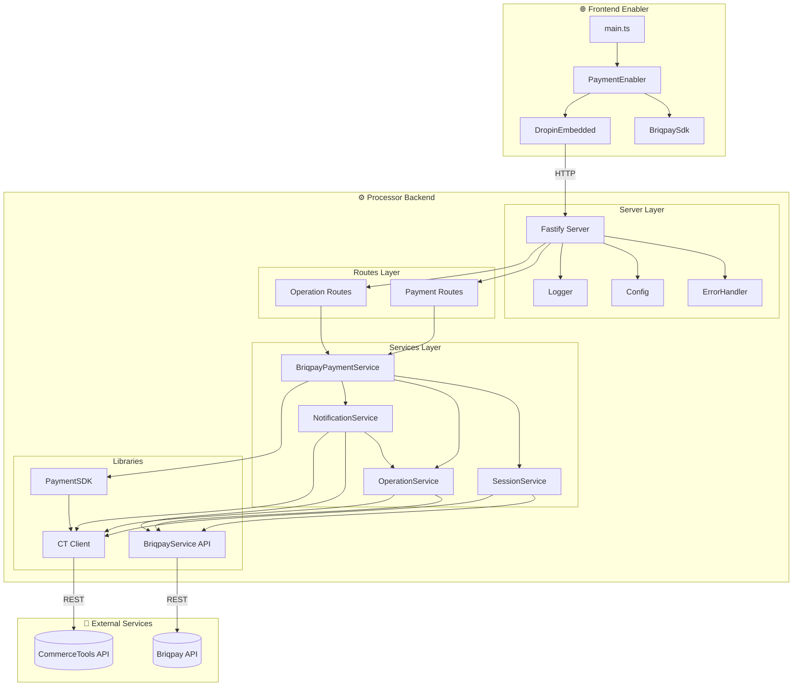
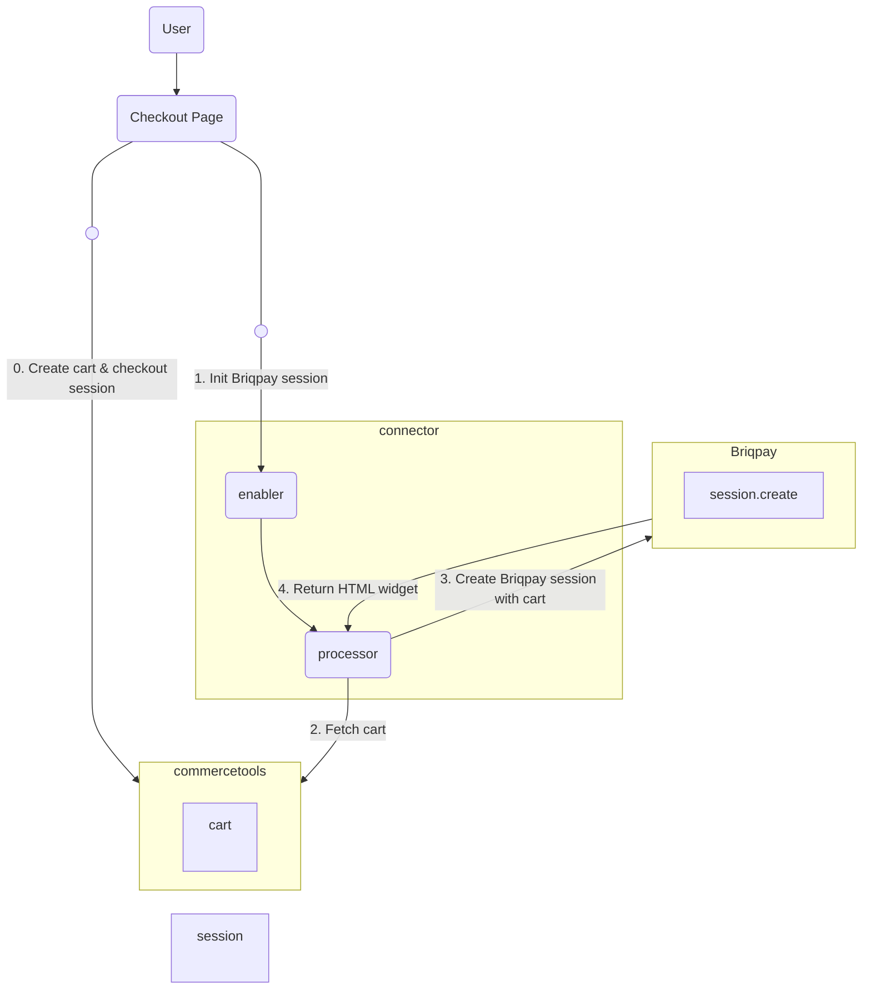
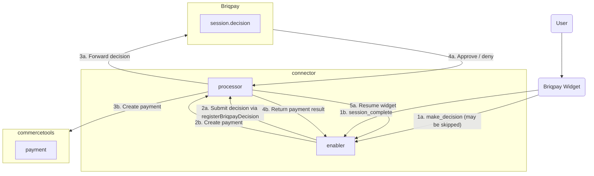
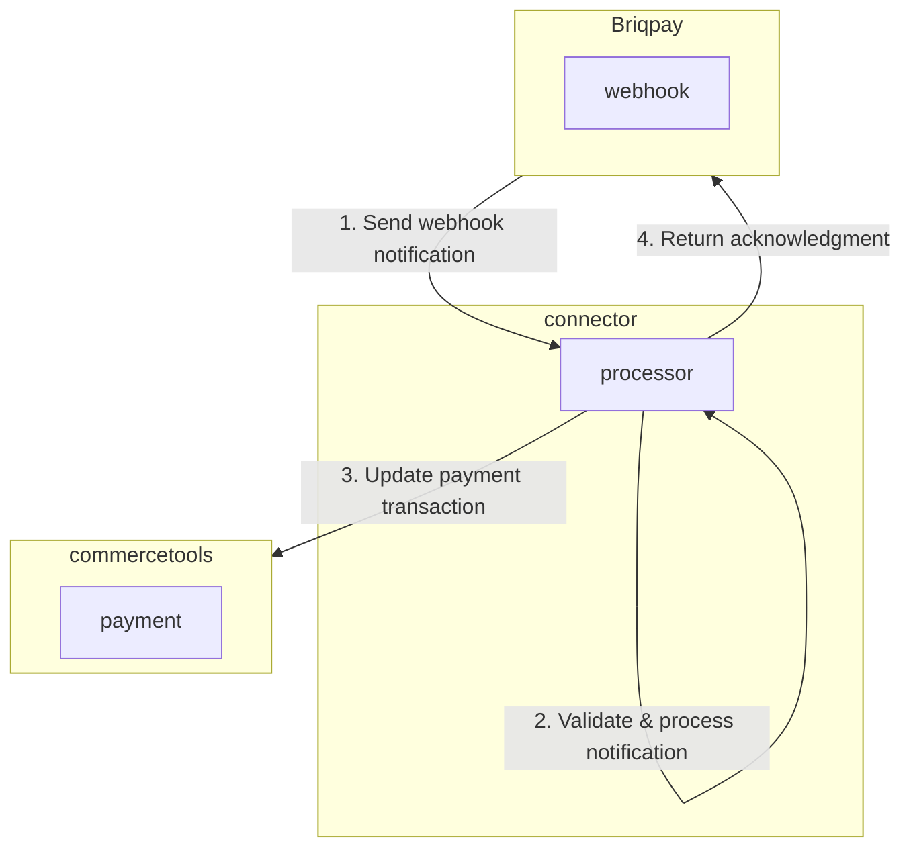

# Briqpay Payment Integration for commercetools Connect

A comprehensive commercetools Connect payment integration connector for Briqpay, providing seamless payment processing capabilities with modern TypeScript architecture, Docker containerization, and enterprise-grade deployment configurations.

- [Features](#features)
- [How to Install](#how-to-install)
- [Overview](#overview)
- [Architecture](#architecture-overview)
- [Development Guide](#development-guide)
- [Testing](#testing)
- [Best Practices](#best-practices)

## Features

- **TypeScript** language support with strict type checking
- **Fastify** high-performance web framework for the processor backend
- **Vite** modern build tool for the enabler frontend
- Uses [commercetools Connect Payments SDK](https://docs.commercetools.com/connect) for commercetools-specific communication
- Displays Briqpay payment widget in a single embedded iframe
- Supports multiple payment methods through Briqpay (invoice, installments, etc.)
- Real-time payment session synchronization between Briqpay and commercetools
- Webhook support for asynchronous payment status updates (capture, refund, cancel)
- Dynamic custom type extension for storing Briqpay session data on orders (extends existing order types or creates new ones)
- Persistence of the merchant's intended `futureOrderNumber` on the cart so it stays stable across CT Session rotations (see [Future Order Number Persistence](#future-order-number-persistence))
- Webhook-driven recovery of payment/order creation when the buyer never returns to the storefront (e.g. off-site payment redirect), with pre-order session data staged on the cart and copied onto the order at creation (see [Webhook-Driven Payment & Order Recovery](#webhook-driven-payment--order-recovery))
- Per-cart Briqpay variant selection via a cart custom field the merchant sets before checkout renders, letting each cart resolve to a different Briqpay checkout variant (e.g. currency- or market-specific) (see [Per-Cart Variant Selection](#per-cart-variant-selection))
- Supports payment operations: authorize, capture, refund, cancel, and reverse
- Includes local development utilities with Docker Compose setup
- Jest testing framework with MSW for API mocking

## How to Install

1. **Create Connect application** and install Briqpay connector in commercetools Connect

2. **Create commercetools API client** with the following scopes (your case may vary):

   > Please refer to the [commercetools documentation regarding scopes](https://docs.commercetools.com/api/scopes), names may change and names might be different from what you see in the GUI.
   - **Manage**:
     - `manage_orders` - Also grants permission to manage Carts
     - `manage_sessions` (Manage Checkout sessions)
     - `manage_types`
     - `manage_payments`
     - `manage_checkout_transactions`
     - `manage_checkout_payment_intents`
     - `manage_key_value_documents`
   - **View**:
     - `view_key_value_documents` (View Custom Objects)
     - `view_states`
     - `view_types`
     - `view_product_selections`
     - `view_attribute_groups`
     - `view_shopping_lists`
     - `view_shipping_methods`
     - `view_categories`
     - `view_discount_codes`
     - `view_products`
     - `view_cart_discounts`
     - `view_orders`
     - `view_stores`
     - `view_tax_categories`
     - `view_order_edits`


After creating your API client, the scopes/permissions should look like this:

```text
client_credentials&scope=manage_orders:{projectKey} view_states:{projectKey} view_types:{projectKey} view_product_selections:{projectKey} view_attribute_groups:{projectKey} view_shopping_lists:{projectKey} manage_sessions:{projectKey} manage_types:{projectKey} manage_checkout_payment_intents:{projectKey} view_categories:{projectKey} manage_key_value_documents:{projectKey} view_discount_codes:{projectKey} view_products:{projectKey} view_cart_discounts:{projectKey} manage_payments:{projectKey} view_orders:{projectKey} view_shipping_methods:{projectKey} view_stores:{projectKey} manage_checkout_transactions:{projectKey} view_tax_categories:{projectKey} view_order_edits:{projectKey}
```

3. **Set commercetools configuration values**:
   - `CTP_PROJECT_KEY`
   - `CTP_CLIENT_ID`
   - `CTP_CLIENT_SECRET`
   - `CTP_AUTH_URL`
   - `CTP_API_URL`
   - `CTP_SESSION_URL`
   - `CTP_JWKS_URL`
   - `CTP_JWT_ISSUER`

4. **Create Briqpay API credentials** and set configuration values:
   - `BRIQPAY_USERNAME`
   - `BRIQPAY_SECRET`
   - `BRIQPAY_WEBHOOK_SECRET` - **Mandatory** for secure webhook processing (HMAC verification) (get your webhook secret at https://app.briqpay.com/dashboard/developers/webhooks)
   - `BRIQPAY_BASE_URL`
   - `BRIQPAY_TERMS_URL`
   - `BRIQPAY_EXTERNAL_WEBHOOK_URL` - **Optional** external webhook URL to receive `order_status`, `capture_status`, and `refund_status` events from Briqpay alongside the internal connector hooks. Must use HTTPS.

   > **Note**: The connector disables Briqpay's automatic session-complete redirect (`disableSessionCompleteRedirect: true`). You must handle post-payment navigation in the enabler's `onComplete` callback (e.g., redirect to your order confirmation page).

5. **Optionally set custom type keys**:

   > **IMPORTANT**: Please use the default names to preserve data integrity.
   - `BRIQPAY_SESSION_CUSTOM_TYPE_KEY` - Default: `briqpay-session-id`
   - `BRIQPAY_PSP_META_DATA_CUSTOMER_FACING_REFERENCE_KEY` - Default: `briqpay-psp-meta-data-customer-facing-reference`
   - `BRIQPAY_PSP_META_DATA_DESCRIPTION_KEY` - Default: `briqpay-psp-meta-data-description`
   - `BRIQPAY_PSP_META_DATA_TYPE_KEY` - Default: `briqpay-psp-meta-data-type`
   - `BRIQPAY_PSP_META_DATA_PAYER_EMAIL_KEY` - Default: `briqpay-psp-meta-data-payer-email`
   - `BRIQPAY_PSP_META_DATA_PAYER_FIRST_NAME_KEY` - Default: `briqpay-psp-meta-data-payer-first-name`
   - `BRIQPAY_PSP_META_DATA_PAYER_LAST_NAME_KEY` - Default: `briqpay-psp-meta-data-payer-last-name`
   - `BRIQPAY_TRANSACTION_DATA_RESERVATION_ID_KEY` - Default: `briqpay-transaction-data-reservation-id`
   - `BRIQPAY_TRANSACTION_DATA_SECONDARY_RESERVATION_ID_KEY` - Default: `briqpay-transaction-data-secondary-reservation-id`
   - `BRIQPAY_TRANSACTION_DATA_PSP_ID_KEY` - Default: `briqpay-transaction-data-psp-id`
   - `BRIQPAY_TRANSACTION_DATA_PSP_DISPLAY_NAME_KEY` - Default: `briqpay-transaction-data-psp-display-name`
   - `BRIQPAY_TRANSACTION_DATA_PSP_INTEGRATION_NAME_KEY` - Default: `briqpay-transaction-data-psp-integration-name`
   - `BRIQPAY_AUTOCAPTURED_KEY` - Default: `briqpay-autocaptured` (Boolean field on the order indicating whether the order was auto-captured)
   - `BRIQPAY_FUTURE_ORDER_NUMBER_KEY` - Default: `briqpay-future-order-number` (cart custom field where the connector persists the intended order number on first Briqpay session creation, so the merchant backend can read it back on subsequent checkout entries — see [Future Order Number Persistence](#future-order-number-persistence))
   - `BRIQPAY_CHECKOUT_TRANSACTION_ITEM_ID_KEY` - Default: `briqpay-checkout-transaction-item-id` (cart custom field where the connector persists the Checkout transaction-item id at first session creation, so the session-less webhook can create a correctly-tagged payment and let Checkout auto-create the order when the buyer never returns — see [Webhook-Driven Payment & Order Recovery](#webhook-driven-payment--order-recovery))
   - `BRIQPAY_VARIANT_ID_KEY` - Default: `briqpay-variant-id` (cart custom field the **merchant** sets before checkout renders to select the Briqpay checkout variant for that cart; read per session creation and forwarded as `product.variantId` — see [Per-Cart Variant Selection](#per-cart-variant-selection))
   - `BRIQPAY_SYNCED_PAYLOAD_HASH_KEY` - Default: `briqpay-synced-payload-hash` (cart custom field where the connector records a hash of the payload the Briqpay session already holds, letting the checkout render skip an update Briqpay would treat as a no-op; purely an optimisation — with the field absent the connector updates on every render, as before)

   > **Note**: The connector dynamically extends existing custom types for the `order` resource type instead of always creating separate types. If field name conflicts exist, Briqpay fields are prefixed with `briqpay-` to avoid data loss.

6. **Optionally set CORS and the decision safeguard**:
   - `ALLOWED_ORIGINS` - Comma-separated list of allowed CORS origins; supports wildcard patterns for subdomains (e.g. `https://your-store.com,https://*.preview.your-store.com`)
   - `BRIQPAY_DISABLE_DECISION_AMOUNT_CHECK` - Leave unset (recommended). Set to exactly `true` to disable the server-side check that verifies the Briqpay session amount and currency against the cart before forwarding a buyer `allow` decision. Any other value is ignored and the check stays enabled.
   - `BRIQPAY_RECONCILE_CART_ON_DRIFT` - Leave unset (default off). Set to exactly `true` to let the connector lower a cart back to the lines Briqpay actually authorized before it creates the Payment, for a buyer who changed the cart after paying (a second tab during a redirect PSP). It only reduces quantities or removes lines, and only when the resulting total matches the authorized amount to the cent; discounts, tiered shipping, price changes and a paid line that is no longer in the cart are left untouched and logged instead. Any other value is ignored and carts are never edited.

7. **Deploy on Connect**

8. Once deployment is successful, store URLs for Enabler and Processor applications as `VITE_PROCESSOR_URL` in your frontend configuration

9. Follow [Usage Guide](#enabler-usage) to integrate the connector in your frontend

The five steps above mirror `connect.yaml`, the connector's deployment spec.

## Overview

The Briqpay integration connector contains two modules:

- **Enabler**: the frontend wrapper that embeds Briqpay's payment widget.
- **Processor**: the backend service that manages Briqpay payment sessions and updates commercetools payment/order data.

## 🏗️ Architecture Overview

This payment integration follows commercetools Connect's dual-component architecture:


```mermaid
flowchart TB
    subgraph Frontend["🌐 Frontend Enabler"]
        direction LR
        FE_Main["main.ts"]
        FE_Enabler["PaymentEnabler"]
        FE_SDK["BriqpaySdk"]
        FE_Dropin["DropinEmbedded"]

        FE_Main --> FE_Enabler
        FE_Enabler --> FE_SDK
        FE_Enabler --> FE_Dropin
    end

    subgraph Processor["⚙️ Processor Backend"]
        direction TB

        subgraph Server["Server Layer"]
            P_Server["Fastify Server"]
            P_ErrorHandler["ErrorHandler"]
            P_Config["Config"]
            P_Logger["Logger"]
        end

        subgraph Routes["Routes Layer"]
            P_PaymentRoutes["Payment Routes"]
            P_OperationRoutes["Operation Routes"]
        end

        subgraph Services["Services Layer"]
            P_BriqpayPaymentSvc["BriqpayPaymentService"]
            P_SessionSvc["SessionService"]
            P_OperationSvc["OperationService"]
            P_NotificationSvc["NotificationService"]
        end

        subgraph Libs["Libraries"]
            P_BriqpayAPI["BriqpayService API"]
            P_PaymentSDK["PaymentSDK"]
            P_CTClient["CT Client"]
        end

        P_Server --> P_ErrorHandler
        P_Server --> P_Config
        P_Server --> P_Logger
        P_Server --> P_PaymentRoutes
        P_Server --> P_OperationRoutes

        P_PaymentRoutes --> P_BriqpayPaymentSvc
        P_OperationRoutes --> P_BriqpayPaymentSvc

        P_BriqpayPaymentSvc --> P_SessionSvc
        P_BriqpayPaymentSvc --> P_OperationSvc
        P_BriqpayPaymentSvc --> P_NotificationSvc
        P_BriqpayPaymentSvc --> P_PaymentSDK

        P_NotificationSvc --> P_OperationSvc

        P_SessionSvc --> P_BriqpayAPI
        P_OperationSvc --> P_BriqpayAPI
        P_NotificationSvc --> P_BriqpayAPI

        P_SessionSvc --> P_CTClient
        P_OperationSvc --> P_CTClient
        P_NotificationSvc --> P_CTClient
        P_PaymentSDK --> P_CTClient
    end

    subgraph External["🔗 External Services"]
        direction LR
        EXT_Briqpay[("Briqpay API")]
        EXT_CT[("CommerceTools API")]
    end

    FE_Dropin -->|"HTTP"| P_Server
    P_BriqpayAPI -->|"REST"| EXT_Briqpay
    P_CTClient -->|"REST"| EXT_CT
```

### 🎯 Enabler (Frontend Component)

- **Purpose**: Frontend wrapper that embeds Briqpay payment components
- **Technology**: TypeScript, Vite, SCSS
- **Port**: 3000
- **Functionality**: Provides payment UI components and manages frontend payment flow

### ⚙️ Processor (Backend Component)

- **Purpose**: Backend middleware for transaction management and commercetools integration
- **Technology**: TypeScript, Fastify, commercetools SDK
- **Port**: 8080
- **Functionality**: Handles payment operations, session management, and commercetools API interactions

### Initial Flow


```mermaid
flowchart TD
    node1(( ))
    node2(( ))
    user("User")-->checkout("Checkout Page")
    subgraph connector
        enabler
        processor
    end
    subgraph coco["commercetools"]
        cart
        session
    end
    subgraph briqpay["Briqpay"]
        session.create
    end
    checkout----node1

    node1--"0. Create cart & checkout session"------>coco

    checkout("Checkout Page")----node2
    processor("processor")--"2. Fetch cart"-->coco
    node2--"1. Init Briqpay session"-->enabler("enabler")-->processor("processor")--"3. Create Briqpay session with cart"-->briqpay("Briqpay")--"4. Return HTML widget"-->processor("processor")
    style coco height:150
    style cart height:80, text-align:center
    style session height:80, text-align:center
```

0. Merchant creates the cart and [checkout session](https://docs.commercetools.com/checkout/installing-checkout#create-checkout-sessions) in commercetools before initializing the Briqpay session.
1. Checkout page retrieves SDK from `enabler`. After loading, it sends request via SDK to `processor` to trigger Briqpay session initialization.
2. The `processor` fetches the latest cart from commercetools using the provided checkout session.
3. Briqpay receives cart details from the `processor` and initializes a payment session.
4. Briqpay returns HTML snippet of the widget containing payment method options. The snippet is returned to the frontend for display.

### Payment Decision Flow


```mermaid
flowchart TD
    user("User")-->widget("Briqpay Widget")
    subgraph connector
        enabler
        processor
    end
    subgraph coco["commercetools"]
        payment
    end
    subgraph briqpay["Briqpay"]
        session.decision
    end

    widget--"1a. make_decision (may be skipped)"-->enabler
    enabler--"2a. Submit decision via registerBriqpayDecision"-->processor
    processor--"3a. Forward decision"-->briqpay
    briqpay--"4a. Approve / deny"-->processor
    processor--"5a. Resume widget"-->enabler
    widget--"1b. session_complete"-->enabler
    enabler--"2b. Create payment"-->processor
    processor--"3b. Create payment"-->coco
    processor--"4b. Return payment result"-->enabler
    style coco height:100
```

The connector activates the decision step (`modules.config.payment.decision.enabled`) for every session it creates, so Briqpay will ask for a decision on some sessions regardless of whether a handler is registered — see [Registering the purchase-decision handler](#registering-the-purchase-decision-handler). Briqpay's widget fires one of two events when the buyer submits the payment form:

1. **`make_decision`** — fired when Briqpay needs a decision. Briqpay decides when one is needed, so it does not necessarily fire on every submission.
   1. The `enabler` calls the handler registered via `registerBriqpayDecision`, or answers `ALLOW` automatically if none is registered, and sends the answer to the `processor` via `/decision`.
   2. The `processor` forwards the decision to Briqpay's API, downgrading an `allow` to a soft reject if the session amount no longer matches the cart — re-syncing the session to the cart first, so a retry can succeed.
   3. Briqpay approves or denies it.
   4. The `enabler` resumes the widget with the result.
2. **`session_complete`** — fired once Briqpay is ready to finalize, either right after an approved decision or directly if no decision was needed.
   1. The `enabler` calls `/payments` on the `processor`.
   2. The `processor` creates the commercetools payment, deriving the authorization state from the Briqpay session.
   3. The result is returned to the frontend for order completion.

### Webhook Notification Flow


```mermaid
flowchart TD
    subgraph connector
        processor
    end
    subgraph coco["commercetools"]
        payment
    end
    subgraph briqpay["Briqpay"]
        webhook
    end

    briqpay--"1. Send webhook notification"-->processor
    processor--"2. Validate & process notification"-->processor
    processor--"3. Update payment transaction"-->coco
    processor--"4. Return acknowledgment"-->briqpay
    style coco height:100
```

1. Briqpay sends webhook notifications for events like `ORDER_STATUS`, `CAPTURE_STATUS`, `REFUND_STATUS`.
2. The `processor` validates and processes the notification.
3. Payment transactions in commercetools are updated based on the notification status.
4. Acknowledgment is returned to Briqpay.

## Important Notes

- The connector stores the Briqpay session ID as a custom field on the commercetools **cart** during checkout, which is then transferred to the order. The custom type is specified by `BRIQPAY_SESSION_CUSTOM_TYPE_KEY`.

- The connector also persists the intended order number on the cart as a `briqpay-future-order-number` custom field at first Briqpay session creation. The merchant backend is expected to read this value back on subsequent checkout entries (e.g. when a customer returns days later) and reuse it when stamping `metadata.futureOrderNumber` on the new CT Session — without this read-back, Briqpay's `reference1` and the eventual `Order.orderNumber` will diverge. See [Future Order Number Persistence](#future-order-number-persistence) for details and integration code.

- If the buyer completes payment off-site and never returns to the storefront (e.g. closes the tab after a hosted-payment-page redirect), the connector still completes the order: the session-less Briqpay webhook creates a correctly-tagged Payment from the `briqpay-checkout-transaction-item-id` persisted on the cart, and any pre-order webhook data is staged on the cart so commercetools copies it onto the order at creation. This is automatic and needs no merchant integration changes. See [Webhook-Driven Payment & Order Recovery](#webhook-driven-payment--order-recovery).

- The connector stamps the PSP identity on each CT **Payment**'s `paymentMethodInfo`, next to `paymentInterface` (`Briqpay`): `method` carries the Briqpay `pspIntegrationName` (e.g. `mollie_cards`) and `name` the human-readable `pspDisplayName` (e.g. "Mollie Cards", shown in the Merchant Center); when a completed session's transaction lacks these optional values, they fall back to `briqpay` / "Briqpay". This mirrors where other payment connectors (e.g. Adyen) store the concrete payment method, so per-payment data lives on the payment; the order-level `briqpay-transaction-data-psp-integration-name` custom field is still written for backward compatibility. The fields are written once, when first known (payment completion or the first webhook that carries them), and never overwritten.

- Webhook notifications from Briqpay are processed asynchronously. Ensure your webhook endpoint is publicly accessible and properly configured in the Briqpay dashboard.

- The connector supports the following payment operations through the `/operations/payment-intents/:id` endpoint:
  - `capturePayment` - Capture an authorized payment
  - `cancelPayment` - Cancel an authorized payment
  - `refundPayment` - Refund a captured payment
  - `reversePayment` - Reverse a payment

- For local development, use the provided Docker Compose setup which includes a mock JWT server for authentication.

## Future Order Number Persistence

### The problem

`metadata.futureOrderNumber` lives on the ephemeral commercetools **CT Session**, not on the cart. CT Sessions expire (typically within hours). When a customer leaves checkout and returns days later, the merchant backend usually mints a **new** `futureOrderNumber` when creating CT Session #2 — because there is nowhere persistent on the cart to look it up.

That is what produces the silent divergence:

- Briqpay session was created against CT Session #1 with `reference1 = X`
- The customer's eventual `Order.orderNumber` is set from CT Session #2's metadata = `Y`
- `Briqpay reference1 (X)  ≠  Order.orderNumber (Y)` → merchant lookups by orderNumber fail to find the order

### How the connector helps

On the very first `/config` call (when the Briqpay session is created), the connector writes the value it received in `metadata.futureOrderNumber` to a **cart custom field** called `briqpay-future-order-number` (configurable via `BRIQPAY_FUTURE_ORDER_NUMBER_KEY`). The write is **once-only** — the connector never overwrites an existing value, so the original number captured on day 1 stays canonical for the cart's entire lifetime.

### What the merchant backend must do

Before generating a new `futureOrderNumber` for the CT Session, fetch the cart and check `cart.custom.fields["briqpay-future-order-number"]`. If it's set, reuse that value instead of minting a fresh one. Without this read-back the connector's persistence is dormant — it writes the field, but nothing reuses it.

Merchant backend implementation:

```ts
// Fetch the cart from commercetools before creating the CT Session
const { data: cart } = await axios.get(
  `${CTP_API_URL}/${CTP_PROJECT_KEY}/carts/${cartId}`,
  { headers: { Authorization: `Bearer ${accessToken}` } },
);

// Reuse the persisted value if present; otherwise mint a fresh one
const persisted = cart.custom?.fields?.["briqpay-future-order-number"];
const futureOrderNumber = persisted ?? generateOrderNumber();

// Stamp it into the CT Session metadata
await createCTSession({
  cart: { cartRef: { id: cartId } },
  metadata: { applicationKey, futureOrderNumber },
});
```

### End-to-end invariant when wired correctly

For any cart that completes a purchase, the following three values are guaranteed identical:

| Source                           | Field                                          |
| -------------------------------- | ---------------------------------------------- |
| commercetools Cart               | `custom.fields["briqpay-future-order-number"]` |
| commercetools auto-created Order | `orderNumber`                                  |
| Briqpay session                  | `references.reference1`                        |

This holds regardless of how many CT Sessions are minted against the same cart or how long the customer takes to return.

## Webhook-Driven Payment & Order Recovery

### The problem

Normally the buyer returns to the storefront after paying, the enabler calls the processor's `/payments` endpoint, a commercetools Payment is created and linked to the cart, and commercetools Checkout auto-creates the Order. On off-site payment flows (e.g. a hosted payment page redirect) the buyer may complete payment and never return — closing the tab — so `/payments` never runs. Without a linked Payment the cart never converts to an Order, even though the payment succeeded.

### How the connector helps

On the first `/config` call (when the Briqpay session is created), the connector persists the Checkout transaction-item id it received from the commercetools Checkout session onto a cart custom field, `briqpay-checkout-transaction-item-id` (configurable via `BRIQPAY_CHECKOUT_TRANSACTION_ITEM_ID_KEY`). That tag is the link commercetools needs to auto-create the Order from a Payment.

When Briqpay later sends the session-less `ORDER_STATUS` webhook for a cart that still has no Payment, the connector reads the persisted tag and creates a correctly-tagged commercetools Payment on the cart, letting Checkout auto-create the Order. If no tag is present (e.g. a flow that does not route through commercetools Checkout), the webhook safely skips Payment creation rather than creating a tagless Payment — a tagless Payment would permanently block Order auto-creation.

Unlike `briqpay-future-order-number` (write-once), the transaction-item id is overwritten whenever a new active Checkout session is started, so the tag always links to the current checkout.

### Copy-on-creation of session data

A pre-order webhook can arrive before the Order exists. When that happens, the connector stages the Briqpay session data (PSP metadata, reservation IDs, etc.) on the cart's custom fields; commercetools copies the cart's custom fields onto the Order when it auto-creates it, so the Order is born with the data instead of losing it to the webhook race. Later webhooks enrich the Order directly once it exists. If the cart has already been converted to an Order (immutable) or deleted by the time the staging write runs, the connector treats it as a benign no-op.

### Requirements

This recovery path is automatic and requires no merchant integration changes — the Checkout transaction-item id is supplied by commercetools' standard Checkout session, not by the storefront. It is active whenever the merchant uses commercetools Checkout. Merchants whose checkout does not flow through commercetools Checkout simply keep the prior behavior (the webhook skips Payment creation); nothing breaks.

## Per-Cart Variant Selection

### The problem

A Briqpay merchant can configure multiple checkout **variants** (different module layouts, per-market rules, display options such as showing the currency code next to the amount). The connector otherwise always creates sessions against the merchant's **default** variant, so there is no way to pick a different variant for a specific shopper or market from commercetools.

### How the connector helps

The connector reads a cart custom field — `briqpay-variant-id` (configurable via `BRIQPAY_VARIANT_ID_KEY`) — on **every** Briqpay session creation and, when present, forwards it as `product.variantId` in the create-session request. Because it is read from the cart each time (never cached, never a deploy-wide constant), **each cart resolves to its own variant**: cart A can use variant X while cart B uses variant Y, in the same connector deployment. When the field is absent or empty, the connector omits `variantId` and Briqpay falls back to the account default variant — so this is fully opt-in and changes nothing for merchants who don't set it.

### What the merchant must do

Set the `briqpay-variant-id` custom field on the cart **before** the checkout renders (i.e. before the enabler triggers the processor's `/config` call that creates the Briqpay session). The value is the Briqpay variant id. The merchant decides per cart how to choose it — e.g. by currency, country, or store.

```ts
// Stamp the chosen Briqpay variant on the cart before initializing checkout.
// The cart must carry a custom type that defines the briqpay-variant-id field
// (the connector's Briqpay type includes it, or use your own type with the same field name).
await axios.post(
  `${CTP_API_URL}/${CTP_PROJECT_KEY}/carts/${cartId}`,
  {
    version: cartVersion,
    actions: [
      {
        action: "setCustomType",
        type: { key: "briqpay-session-id", typeId: "type" },
      },
      {
        action: "setCustomField",
        name: "briqpay-variant-id",
        value: chosenBriqpayVariantId,
      },
    ],
  },
  { headers: { Authorization: `Bearer ${accessToken}` } },
);
```

### Timing note (create-time binding)

`variantId` is honored only at session **creation**, not on update. The connector reuses an existing Briqpay session when the cart already carries a `briqpay-session-id` (it updates cart/amount data, which does not carry a variant). So the variant is bound on the first render for that cart — changing `briqpay-variant-id` after a session already exists on the cart will not repoint the live session. Set it before the first checkout render for the cart.

## 🚀 Quick Start

### Prerequisites

1. **Node.js 20+** - Required for both components
2. **Docker & Docker Compose** - For local development environment
3. **commercetools Project** - With API client configured
4. **Briqpay Account** - With API credentials

### Environment Setup

1. **Clone and navigate to the project**:

   ```bash
   cd commercetools
   ```

2. **Configure environment variables**:

   ```bash
   # Enabler environment
   cp enabler/.env.template enabler/.env

   # Processor environment
   cp processor/.env.template processor/.env
   ```

3. **Update environment files** with your actual credentials:
   - commercetools API credentials (project key, client ID, secret)
   - Briqpay API credentials (username, secret)
   - URLs for your environment (terms, confirmation pages)

### Local Development

#### Option 1: Docker Compose (Recommended)

```bash
# Build enabler first (required for Docker setup)
cd enabler && npm run build && cd ..

# Start all services with Docker Compose
docker-compose up
```

This starts three services:

- **JWT Server** (port 9002 → 9000 internal) - Mock JWT server for development
- **Enabler** (port 3000) - Frontend payment components
- **Processor** (port 8080) - Backend payment services

#### Option 2: Manual Development

```bash
# Terminal 1: Start Processor
cd processor
npm install

npm run watch

# Terminal 2: Start Enabler
cd enabler
npm install
npm run dev

# Terminal 3: Start JWT Server (if not using Docker)
npx --package jwt-mock-server -y start
```

## Development Guide

### Folder Structure

```
├── enabler
│   ├── src
│   │   ├── components/
│   │   ├── dropin/
│   │   ├── dtos/
│   │   ├── payment-enabler/
│   │   ├── style/
│   │   ├── briqpay-sdk.ts
│   │   └── main.ts
│   ├── dev-utils/
│   ├── test
│   ├── index.html
│   ├── vite.config.ts
│   └── package.json
├── processor
│   ├── src
│   │   ├── config/
│   │   ├── connectors/
│   │   ├── custom-types/
│   │   ├── dtos/
│   │   ├── libs/
│   │   ├── routes/
│   │   ├── server/
│   │   ├── services/
│   │   ├── global.d.ts
│   │   ├── main.ts
│   │   └── payment-sdk.ts
│   ├── test
│   └── package.json
├── connect.yaml
├── docker-compose.yaml
└── README.md
```

### Deployment Configuration

The full deployment spec — every configuration key, its default, and whether it's required or secured — is `connect.yaml` in the repo root. It mirrors the variable list in [How to Install](#how-to-install); this doc doesn't keep a second copy.

### Enabler Usage

To integrate the Briqpay payment enabler in your frontend:

```typescript
import { Enabler } from "connector-enabler";

// Create the enabler instance (never rejects - /config failures surface at createDropinBuilder)
const enabler = new Enabler({
  processorUrl: "https://your-processor-url",
  sessionId: "commercetools-checkout-session-id",
  onComplete: (result) => {
    console.log("Payment completed:", result);
    // Handle successful payment - create order
  },
  onError: (error) => {
    console.error("Payment error:", error);
    // Handle payment error
  },
});

// Create the drop-in builder
// Use "briqpay" to match the Payment Integration type set by the connector.
// "embedded" is also accepted as a backward-compatible alias.
const builder = await enabler.createDropinBuilder("briqpay");

// Build and mount the payment component
const dropin = builder.build({
  onDropinReady: async () => {
    console.log("Briqpay widget is ready");
  },
});

// Mount to your container element
dropin.mount("#payment-container");

// When user is ready to complete payment
await dropin.submit();
```

#### Registering the purchase-decision handler

Optional — the connector activates the decision step on every session it
creates, so Briqpay will ask for a decision, but if nothing is registered
the enabler answers `ALLOW` automatically and the purchase proceeds as if
the decision step didn't exist. Register a handler only if you want to run
your own validation first. Briqpay decides when a decision is needed, so
this does not necessarily fire on every submission.

There is no `.build()`-time option for this: the enabler only ever _reads_
`window.briqpayConnector.onDecision`, it never calls into your code to ask
for it. Set it directly, anywhere on the page, at any time before the buyer
reaches the payment step:

```typescript
window.briqpayConnector = window.briqpayConnector || {};
window.briqpayConnector.onDecision = async (sdk, _data) => {
  // Validate here, then return the answer - returning it is what sends it.
  const isValid = await checkCartAgainstSession(knownCtSessionId);
  return {
    decision: isValid ? "allow" : "reject",
  };
};
```

`window.briqpayConnector` is this connector's own config namespace — kept
deliberately separate from `window._briqpay`, which is Briqpay's core
widget script's global (`briq.min.js`, shared across every Briqpay
integration). Merchants only ever call into `_briqpay`; `briqpayConnector`
is the reverse direction, a value the merchant sets and the enabler reads.
The `|| {}` merge is defensive, matching the same pattern commercetools'
own SDK uses for `window.commercetoolsCheckout` — this connector is the
only thing that populates `briqpayConnector` today, but keeping the merge
means adding a second key later never risks clobbering the first.

This works the same way regardless of how you render the payment step — a
custom UI built with `createDropinBuilder`/`createComponentBuilder`, or the
hosted commercetools Checkout (`paymentFlow`/`checkoutFlow`), which has no
config surface of its own for a per-payment-method callback. It matters
most for the hosted case: the enabler bundle is injected by commercetools'
checkout application at a time you don't control, so a mechanism that
requires calling _into_ enabler code (rather than the enabler reading a
value _you_ set) would race against that load. A plain assignment has no
such dependency.

If you already import `connector-enabler` directly — e.g. because you're
building a custom UI with `createDropinBuilder`/`createComponentBuilder` —
`registerBriqpayDecision` is equivalent sugar for the same assignment, with
type-checking on the callback:

```typescript
import { BRIQPAY_DECISION, registerBriqpayDecision } from "connector-enabler";

registerBriqpayDecision(async (sdk, _data) => {
  const isValid = await checkCartAgainstSession(knownCtSessionId);
  return {
    decision: isValid ? BRIQPAY_DECISION.ALLOW : BRIQPAY_DECISION.REJECT,
  };
});
```

Once registered, if it has not answered within 20 seconds — or throws —
the decision is abandoned and nothing is sent. Briqpay blocks the purchase
and asks the buyer to retry. Nothing is charged. That failure mode only
applies to a handler that was actually asked to validate: it is not the
same as never registering one at all, which defaults to `ALLOW` instead.

> **Note:** the handler runs in the buyer's browser, so its answer can be
> forged. The processor guards the money independently: an `allow` is only
> forwarded if the Briqpay session amount and currency still match the cart
> (see `BRIQPAY_DISABLE_DECISION_AMOUNT_CHECK` in the processor README).
> Run any other check the buyer must not influence on your own server.

### Local Testing

To test the `processor` directly without using the `enabler`, you can send requests to the endpoints:

```bash
# Get payment configuration (requires checkout session)
curl --location 'http://localhost:8080/config' \
  --header 'X-Session-Id: your-checkout-session-id'

# Submit payment decision
curl --location 'http://localhost:8080/decision' \
  --header 'Content-Type: application/json' \
  --header 'X-Session-Id: your-checkout-session-id' \
  --data '{
    "sessionId": "briqpay-session-id",
    "decision": "allow"
  }'

# Create payment (outcome derived from the Briqpay session)
curl --location 'http://localhost:8080/payments' \
  --header 'Content-Type: application/json' \
  --header 'X-Session-Id: your-checkout-session-id' \
  --data '{
    "paymentMethod": {
      "type": "briqpay"
    }
  }'

# Health check
curl --location 'http://localhost:8080/operations/status' \
  --header 'Authorization: Bearer your-jwt-token'
```

## 🔧 Configuration

Required API Client scopes and the full list of configuration variables are in [How to Install](#how-to-install).

For local development, copy `processor/.env.template` to `processor/.env` and `enabler/.env.template` to `enabler/.env`, then fill in the values from that same list.

## 🏛️ Deployment

### commercetools Connect Deployment

1. **Build the enabler**:

   ```bash
   cd enabler
   npm run build
   cd ..
   ```

2. **Deploy via commercetools Connect**:
   - Use the provided `connect.yaml` configuration
   - The connector will be deployed as two applications:
     - `enabler` (assets application type)
     - `processor` (service application type)

3. **Post-deployment hooks**:
   - `postDeploy`: Automatically creates or extends custom types for Briqpay data storage
   - `preUndeploy`: Cleanup custom types on undeployment

### Docker Deployment

The `docker-compose.yaml` provides production-ready containerization:

```yaml
services:
  jwt-server: # JWT authentication service (port 9002 → 9000)
  enabler: # Frontend payment components (port 3000)
  processor: # Backend payment services (port 8080)
```

**Key Features**:

- Node.js 24 Alpine containers (node:24.13-alpine)
- Volume mounting for development
- Proper service dependencies
- Environment variable injection
- Port mapping for local access

## 🧪 Testing

### Enabler Testing

```bash
cd enabler

# Run tests
npm run test

# Run with coverage
npm run test:coverage

# Watch mode
npm run test:watch
```

### Processor Testing

```bash
cd processor

# Run tests
npm run test

# Run with coverage
npm run test:coverage

# Watch mode
npm run test:watch
```

### Test Coverage

- Unit tests for all service classes
- Integration tests for API endpoints
- Mock service responses using MSW
- Type validation tests

## 🔄 Development Workflow

### Code Quality Tools

```bash
# Linting
npm run lint

# Auto-fix
npm run lint:fix

# Formatting (Processor only)
npm run lint:fix  # Includes Prettier
```

### Build Process

```bash
# Enabler - Build for production
cd enabler && npm run build

# Processor - Compile TypeScript
cd processor && npm run build
```

### Development Servers

```bash
# Enabler dev server (hot reload)
cd enabler && npm run dev

# Processor with auto-restart
cd processor && npm run watch
```

## 🎯 Core Functionality

### Payment Flow Architecture

1. **Initialization**: Enabler loads Briqpay components
2. **Session Creation**: Processor creates Briqpay session via API
3. **Payment UI**: Enabler renders Briqpay payment interface
4. **Transaction Processing**: Processor handles payment operations
5. **Status Updates**: Payment status synchronized with commercetools

### Key Services

#### Processor Services

- **BriqpayService**: Core Briqpay API integration
- **SessionService**: Payment session management
- **OperationService**: Payment operation handling
- **NotificationService**: Webhook processing

#### Enabler Components

- **BriqpayPaymentEnabler**: Main payment enabler factory
- **BriqpaySdk**: Client-side SDK for suspend/resume/decision handling
- **DropinEmbedded**: Embedded payment drop-in component

## 🔒 Security Considerations

- **Session authentication**: requests to the processor authenticate via the commercetools checkout session (`X-Session-Id` header), verified by `@commercetools/connect-payments-sdk`'s session hook.
- **Credential storage**: `CTP_CLIENT_SECRET` and `BRIQPAY_SECRET` are declared under `securedConfiguration` in `connect.yaml`, so commercetools Connect stores them encrypted.
- **Webhook verification**: Briqpay webhook notifications are HMAC-verified when `BRIQPAY_WEBHOOK_SECRET` is set (see `isHmacVerificationEnabled` in `processor/src/libs/briqpay/webhook-verification.ts`).
- **CORS**: allowed origins are controlled by `ALLOWED_ORIGINS`; non-localhost entries must be HTTPS (enforced at startup, see `processor/src/config/env-validation.ts`).

## 🐛 Troubleshooting

### Common Issues

1. **Build Failures**:

   ```bash
   # Clear node modules and reinstall
   rm -rf node_modules package-lock.json
   npm install
   ```

2. **Port Conflicts**:

   ```bash
   # Check port usage
   lsof -i :3000  # Enabler
   lsof -i :8080  # Processor
   lsof -i :9002  # JWT Server
   ```

3. **Environment Issues**:
   - Verify all required environment variables are set
   - Check commercetools API client permissions
   - Validate Briqpay API credentials

### Debug Mode

Set the `LOGGER_LEVEL` environment variable to `debug` for verbose logging:

```bash
# In processor/.env
LOGGER_LEVEL=debug

# Then run
npm run watch
```

## 📚 API Documentation

### Processor Endpoints

**Payment Routes** (root level):

- `GET /config` - Get payment configuration and Briqpay session
- `POST /decision` - Submit payment decision to Briqpay
- `POST /payments` - Create payment in commercetools
- `POST /notifications` - Handle Briqpay webhooks

**Operation Routes** (`/operations` prefix):

- `GET /operations/config` - Get configuration
- `GET /operations/status` - Health check status
- `GET /operations/payment-components` - Get supported payment components
- `POST /operations/payment-intents/:id` - Modify payment (capture/cancel/refund)
- `POST /operations/transactions` - Create transaction

### Enabler Interface

```typescript
// Import from the built enabler
import { Enabler } from "connector-enabler";

// Create enabler instance (never rejects - /config failures surface at createDropinBuilder)
const enabler = new Enabler({
  processorUrl: "https://processor-url",
  sessionId: "commercetools-session-id",
  onComplete: (result) => {
    if (result.isSuccess) {
      console.log("Payment completed:", result.paymentReference);
    }
  },
  onError: (error) => console.error(error),
});

// Create and mount drop-in (use "briqpay"; "embedded" is a backward-compatible alias)
const builder = await enabler.createDropinBuilder("briqpay");
const dropin = builder.build({ onDropinReady: async () => {} });
dropin.mount("#payment-container");
```

## 🏛️ Processor Deep Dive

### Core Architecture

The processor is built on **Fastify** with a plugin-based architecture for maximum performance and modularity:

```typescript
// Main server setup
import { setupFastify } from "./server/server";

// Server configuration with plugins
const server = await setupFastify();
await server.listen({ port: 8080, host: "0.0.0.0" });
```

### Service Layer Architecture

#### BriqpayService (Core Integration)

The `BriqpayService` class handles all direct Briqpay API interactions:

```typescript
class BriqpayService {
  // Session management
  async createSession(
    ctCart: Cart,
    amountPlanned: PaymentAmount,
    hostname: string,
  ): Promise<BriqpayResponse>;
  async updateSession(
    sessionId: string,
    cart: Cart,
    amount: Money,
  ): Promise<MediumBriqpayResponse>;
  async getSession(sessionId: string): Promise<MediumBriqpayResponse>;

  // Payment operations
  async capture(
    ctCart: Cart,
    amountPlanned: PaymentAmount,
    sessionId: string,
  ): Promise<CaptureResponse>;
  async refund(
    ctCart: Cart,
    amountPlanned: PaymentAmount,
    sessionId: string,
    captureId?: string,
  ): Promise<RefundResponse>;
  async cancel(sessionId: string): Promise<{ status: PaymentOutcome }>;

  // Decision handling
  makeDecision(
    sessionId: string,
    decisionRequest: BriqpayDecisionRequest,
  ): Promise<Response>;
}
```

**Key Features**:

- Request/response validation using TypeBox schemas
- Error handling with commercetools-compatible error mapping
- Session state management via commercetools cart custom fields

#### BriqpaySessionService

Manages payment sessions across the commercetools ecosystem:

```typescript
class BriqpaySessionService {
  // Creates or updates Briqpay session based on cart state
  async createOrUpdateBriqpaySession(
    ctCart: Cart,
    amountPlanned: PaymentAmount,
    hostname: string,
  ): Promise<MediumBriqpayResponse>;

  // Persists Briqpay session metadata on the cart custom fields:
  //  - briqpay-session-id: always kept in sync with the active Briqpay session
  //  - briqpay-future-order-number: write-once on first session creation; never overwritten
  //  - briqpay-checkout-transaction-item-id: overwritten on each new active Checkout session
  //    so the webhook fallback always links to the current checkout
  async updateCartWithBriqpaySession(
    ctCart: Cart,
    briqpaySessionId: string,
    futureOrderNumber?: string,
    checkoutTransactionItemId?: string,
  ): Promise<void>;
}
```

**Session Storage Strategy**:

- Uses commercetools custom fields on Cart objects
- Custom Type key: configurable via `BRIQPAY_SESSION_CUSTOM_TYPE_KEY`
- Compares cart with existing session to determine if update is needed
- Enables session recovery across frontend/backend boundaries
- Persists the intended order number (`briqpay-future-order-number`) write-once on first creation so the merchant backend can reuse it across CT Session rotations (see [Future Order Number Persistence](#future-order-number-persistence))
- Persists the Checkout transaction-item id (`briqpay-checkout-transaction-item-id`), overwritten on each new active Checkout session, so the session-less webhook can recover payment/order creation when the buyer never returns (see [Webhook-Driven Payment & Order Recovery](#webhook-driven-payment--order-recovery))

#### BriqpayOperationService

Handles commercetools payment operations and state transitions:

```typescript
class BriqpayOperationService {
  // Capture an authorized payment
  async capturePayment(
    request: CapturePaymentRequest,
  ): Promise<PaymentProviderModificationResponse>;

  // Cancel an authorized payment
  async cancelPayment(
    request: CancelPaymentRequest,
  ): Promise<PaymentProviderModificationResponse>;

  // Refund a captured payment
  async refundPayment(
    request: RefundPaymentRequest,
  ): Promise<PaymentProviderModificationResponse>;

  // Reverse a payment
  async reversePayment(
    request: ReversePaymentRequest,
  ): Promise<PaymentProviderModificationResponse>;
}
```

**Operation Flow**:

1. Receives payment operation from commercetools
2. Validates operation against current payment state (e.g., cannot cancel captured payment)
3. Executes corresponding Briqpay API call
4. Updates commercetools payment with transaction results

#### NotificationService

Processes Briqpay webhooks for asynchronous payment updates:

```typescript
class BriqpayNotificationService {
  // Handle webhook notifications
  async processNotification(opts: {
    data: NotificationRequestSchemaDTO;
  }): Promise<void>;
}
```

**Webhook Security**:

- Session validation via Briqpay API (fetches session to verify sessionId exists in Briqpay's system)
- Comprehensive logging for audit trails
- Request/response audit logging with correlation IDs

### Database Integration & Custom Types

#### Custom Type Management

The processor dynamically extends existing commercetools custom types or creates new ones:

```typescript
// Post-deployment hook ensures Briqpay fields exist:
export async function createBriqpayCustomType(key: string) {
  // 1. Check if Briqpay's own type exists (backward compatibility)
  // 2. If not, query ALL types for 'order' resource
  // 3. Extend first found type with Briqpay fields
  // 4. Handle field conflicts by prefixing (e.g., 'briqpay-sessionId')
  // 5. Fallback to creating new Briqpay type if no order types exist
  // Fields added to the target type:
  // - briqpay-session-id: Session ID (or prefixed if conflict)
  // - briqpay-psp-meta-data-customer-facing-reference: PSP customer reference
  // - briqpay-psp-meta-data-description: PSP description
  // - briqpay-psp-meta-data-type: PSP type
  // - briqpay-psp-meta-data-payer-email: Payer email
  // - briqpay-psp-meta-data-payer-first-name: Payer first name
  // - briqpay-psp-meta-data-payer-last-name: Payer last name
  // - briqpay-transaction-data-reservation-id: Reservation ID
  // - briqpay-transaction-data-secondary-reservation-id: Secondary reservation ID
  // - briqpay-transaction-data-psp-id: PSP ID
  // - briqpay-transaction-data-psp-display-name: PSP display name
  // - briqpay-transaction-data-psp-integration-name: PSP integration name
  // - briqpay-autocaptured: Boolean flag indicating whether the order was auto-captured
  // - briqpay-future-order-number: Order number the merchant intends for this cart;
  //   written write-once on first Briqpay session creation so the merchant backend
  //   can read it back on subsequent checkout entries (see "Future Order Number
  //   Persistence" section).
  // - briqpay-checkout-transaction-item-id: Checkout transaction-item id persisted on the
  //   cart at first session creation so the session-less webhook can create a correctly-tagged
  //   Payment and let Checkout auto-create the Order when the buyer never returns (see
  //   "Webhook-Driven Payment & Order Recovery" section).
  // - briqpay-variant-id: Briqpay checkout variant id the MERCHANT sets on the cart before
  //   checkout renders; the connector reads it per session creation and forwards it as
  //   product.variantId (see "Per-Cart Variant Selection" section). Not written by the connector.
}
```

### API Routes & Endpoints

The processor exposes the following routes:

**Briqpay Payment Routes** (root level):

- `GET /config` - Returns Briqpay session config and HTML snippet
- `POST /decision` - Submits payment decision to Briqpay (allow/reject)
- `POST /payments` - Creates payment in commercetools
- `POST /notifications` - Handles Briqpay webhook notifications

**Operation Routes** (`/operations` prefix):

- `GET /operations/config` - Get payment configuration
- `GET /operations/status` - Health check status
- `GET /operations/payment-components` - Get supported payment components
- `POST /operations/payment-intents/:id` - Modify payment (capture/cancel/refund)
- `POST /operations/transactions` - Create transaction

### Request/Response Validation

All endpoints use **TypeBox** schemas for runtime validation. Schemas are defined in `src/dtos/` directory.

### Error Handling Strategy

The processor uses custom error classes defined in `src/libs/errors/briqpay-errors.ts`:

- **SessionError** - Session-related failures
- **ValidationError** - Invalid request data (400)
- **ErrorInvalidOperation** - Invalid payment operation (from SDK)

Errors are handled by Fastify's error handler and returned in commercetools-compatible format.

### Security Implementation

Authentication is handled by the commercetools Connect Payments SDK:

- **SessionHeaderAuthenticationHook** - Validates `X-Session-Id` header for frontend routes
- **JWTAuthenticationHook** - Validates JWT tokens for Merchant Center routes
- **Oauth2AuthenticationHook** - Validates OAuth2 tokens for backend operations

#### Security Measures

- **JWT Token Validation**: Using commercetools JWKS endpoint
- **Input Validation**: Strict TypeBox schema validation with regex patterns for session IDs
- **HTTPS Enforcement**: Secure all API communications (URLs must use HTTPS in production)
- **CORS Configuration**: Configurable allowed origins via `ALLOWED_ORIGINS` environment variable (supports wildcard patterns, e.g. `https://*.preview.example.com`)
- **Security Headers**: X-Frame-Options, X-Content-Type-Options, HSTS, CSP, and more
- **Audit Logging**: Request/response logging with correlation IDs for security monitoring
- **Environment Validation**: Fail-fast startup if required environment variables are missing
- **Server-Side Decision Handling**: `/decision` verifies session ownership and the session amount against the cart before forwarding an `allow` (soft reject on mismatch)

### Testing Strategy

Tests are located in the `test/` directory and use Jest with MSW for API mocking.

```bash
# Run tests
npm run test

# Run with coverage
npm run test:coverage
```

Coverage thresholds are set to 75% for branches, functions, lines, and statements.

### Monitoring & Observability

The processor uses `@commercetools-backend/loggers` via `appLogger` for structured logging:

```typescript
import { appLogger } from "./payment-sdk";

appLogger.info({ sessionId, cartId }, "Processing payment");
appLogger.error({ error }, "Payment failed");
```

Configure log level via `LOGGER_LEVEL` environment variable (default: `info`).

### Deployment Considerations

The processor uses environment variables for all configuration. See [How to Install](#how-to-install) for the complete list. Key deployment notes:

- **Briqpay URL**: Use `https://playground-api.briqpay.com/v3` for testing, production URL for live
- **Logging**: Configure `LOGGER_LEVEL` (default: `info`)
- **Health Check**: Configure timeout via `HEALTH_CHECK_TIMEOUT` (default: `5000`ms)
- **CORS**: Set `ALLOWED_ORIGINS` for production deployments (supports wildcard patterns for dynamic preview environments)

## Best Practices

- **Create cart before initializing Briqpay session**: Ensure the commercetools cart is created with all line items, shipping address, and billing address before initializing the Briqpay payment session. This allows Briqpay to display accurate pricing and available payment methods.

- **Include shipping country in cart**: Before initializing the Briqpay session, assign the shipping country to the cart. This enables commercetools to calculate tax-included prices correctly, reducing round-trips between Briqpay and the connector.

- **Handle webhook notifications**: Configure your Briqpay webhook URL to point to your processor's `/notifications` endpoint. Ensure this endpoint is publicly accessible for production deployments.

- **Use checkout sessions**: Always use commercetools checkout sessions (`X-Session-Id` header) for secure communication between the enabler and processor. Never expose raw API credentials to the frontend.

- **Test with Briqpay sandbox**: Use the Briqpay playground environment (`https://playground-api.briqpay.com/v3`) for development and testing before switching to production.

- **Monitor payment transactions**: Regularly check payment transaction states in commercetools to ensure webhooks are being processed correctly. Failed webhooks may require manual intervention.

- **Handle payment failures gracefully**: Implement proper error handling in your `onError` callback to display user-friendly messages when payments fail.

- **Keep custom type key consistent**: If you specify a custom `BRIQPAY_SESSION_CUSTOM_TYPE_KEY`, ensure it remains consistent across deployments to avoid orphaned session references.
